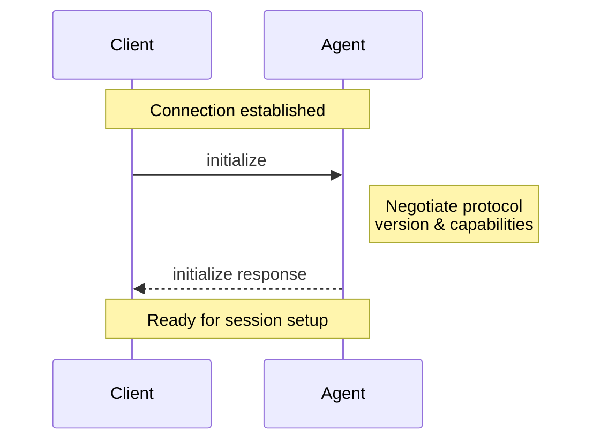
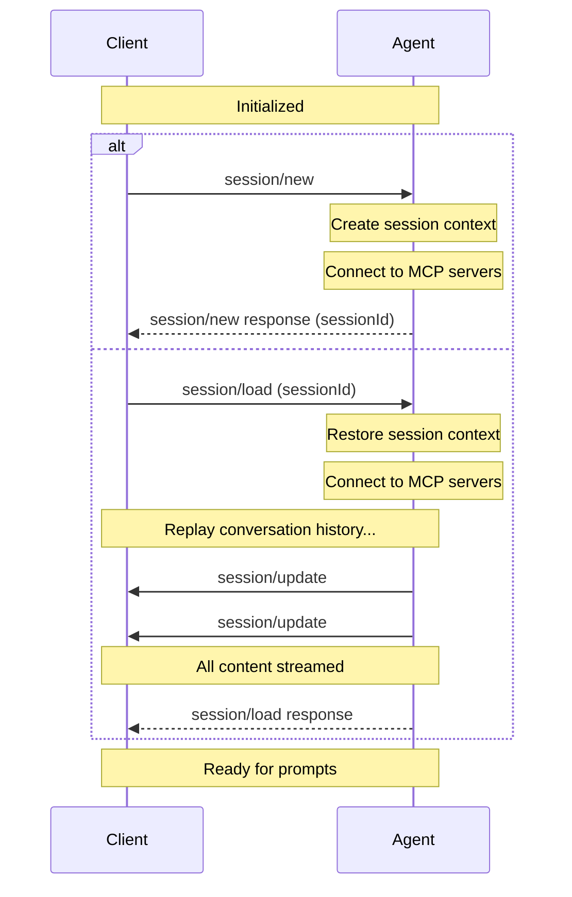
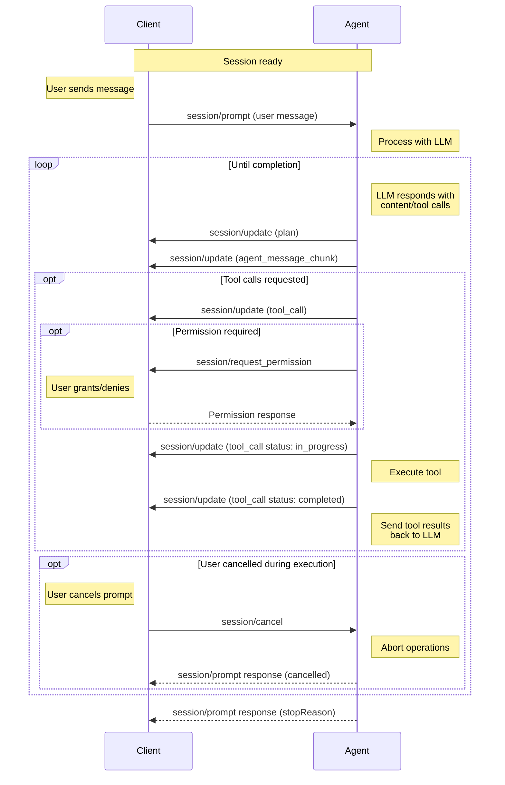
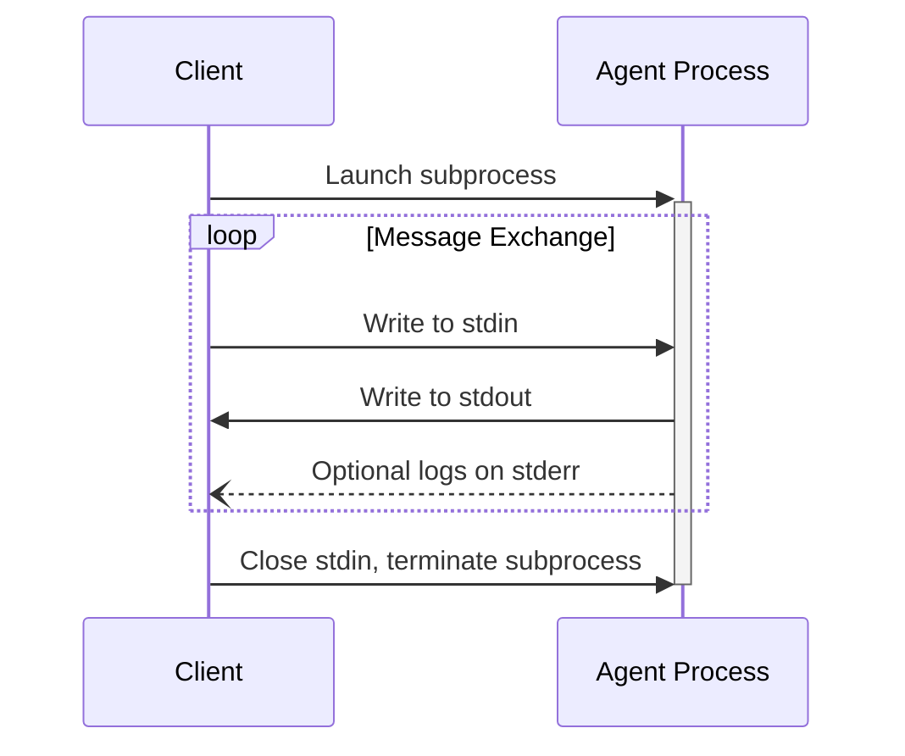

# Agent Client Protocol Docs

The Agent Client Protocol (ACP) standardizes communication between code editors/IDEs and coding agents and is suitable for both local and remote scenarios.

## Why ACP?

AI coding agents and editors are tightly coupled but interoperability isn't the default. Each editor must build custom integrations for every agent they want to support, and agents must implement editor-specific APIs to reach users.
This creates several problems:

* Integration overhead: Every new agent-editor combination requires custom work
* Limited compatibility: Agents work with only a subset of available editors
* Developer lock-in: Choosing an agent often means accepting their available interfaces

ACP solves this by providing a standardized protocol for agent-editor communication, similar to how the [Language Server Protocol (LSP)](https://microsoft.github.io/language-server-protocol/) standardized language server integration.

Agents that implement ACP work with any compatible editor. Editors that support ACP gain access to the entire ecosystem of ACP-compatible agents.
This decoupling allows both sides to innovate independently while giving developers the freedom to choose the best tools for their workflow.

## Overview

ACP assumes that the user is primarily in their editor, and wants to reach out and use agents to assist them with specific tasks.

ACP is suitable for both local and remote scenarios:

* Local agents run as sub-processes of the code editor, communicating via JSON-RPC over stdio.
* Remote agents can be hosted in the cloud or on separate infrastructure, communicating over HTTP or WebSocket

  Full support for remote agents is a work in progress. We are actively
  collaborating with agentic platforms to ensure the protocol addresses the
  specific requirements of cloud-hosted and remote deployment scenarios.

The protocol re-uses the JSON representations used in MCP where possible, but includes custom types for useful agentic coding UX elements, like displaying diffs.

The default format for user-readable text is Markdown, which allows enough flexibility to represent rich formatting without requiring that the code editor is capable of rendering HTML.

# Architecture

The Agent Client Protocol defines a standard interface for communication between AI agents and client applications. The architecture is designed to be flexible, extensible, and platform-agnostic.

## Setup

When the user tries to connect to an agent, the editor boots the agent sub-process on demand, and all communication happens over stdin/stdout.

Each connection can support several concurrent sessions, so you can have multiple trains of thought going on at once.

ACP makes heavy use of JSON-RPC notifications to allow the agent to stream updates to the UI in real-time. It also uses JSON-RPC's bidirectional requests to allow the agent to make requests of the code editor: for example to request permissions for a tool call.

## MCP

Commonly the code editor will have user-configured MCP servers. When forwarding the prompt from the user, it passes configuration for these to the agent. This allows the agent to connect directly to the MCP server.

The code editor may itself also wish to export MCP based tools. Instead of trying to run MCP and ACP on the same socket, the code editor can provide its own MCP server as configuration. As agents may only support MCP over stdio, the code editor can provide a small proxy that tunnels requests back to itself:

# Overview

The Agent Client Protocol allows [Agents](#agent) and [Clients](#client) to communicate by exposing methods that each side can call and sending notifications to inform each other of events.

## Communication Model

The protocol follows the [JSON-RPC 2.0](https://www.jsonrpc.org/specification) specification with two types of messages:

* **Methods**: Request-response pairs that expect a result or error
* **Notifications**: One-way messages that don't expect a response

## Message Flow

A typical flow follows this pattern:

<Steps>
  <Step title="Initialization Phase">
    * Client → Agent: `initialize` to establish connection
    * Client → Agent: `authenticate` if required by the Agent
  </Step>
  <Step title="Session Setup - either:">
    * Client → Agent: `session/new` to create a new session
    * Client → Agent: `session/load` to resume an existing session if supported
  </Step>
  <Step title="Prompt Turn">
    * Client → Agent: `session/prompt` to send user message
    * Agent → Client: `session/update` notifications for progress updates
    * Agent → Client: File operations or permission requests as needed
    * Client → Agent: `session/cancel` to interrupt processing if needed
    * Turn ends and the Agent sends the `session/prompt` response with a stop reason
  </Step>
</Steps>

## Agent

Agents are programs that use generative AI to autonomously modify code. They typically run as subprocesses of the Client.

## Client

Clients provide the interface between users and agents. They are typically code editors (IDEs, text editors) but can also be other UIs for interacting with agents. Clients manage the environment, handle user interactions, and control access to resources.

## Argument requirements

* All file paths in the protocol MUST be absolute.
* Line numbers are 1-based

## Error Handling

All methods follow standard JSON-RPC 2.0 [error handling](https://www.jsonrpc.org/specification#error_object):

* Successful responses include a `result` field
* Errors include an `error` object with `code` and `message`
* Notifications never receive responses (success or error)

## Extensibility

The protocol provides built-in mechanisms for adding custom functionality while maintaining compatibility:

* Add custom data using `_meta` fields
* Create custom methods by prefixing their name with underscore (`_`)
* Advertise custom capabilities during initialization


# Initialization

> How all Agent Client Protocol connections begin

The Initialization phase allows [Clients](./overview#client) and [Agents](./overview#agent) to negotiate protocol versions, capabilities, and authentication methods.


Before a Session can be created, Clients MUST initialize the connection by calling the `initialize` method with:

* The latest [protocol version](#protocol-version) supported
* The [capabilities](#client-capabilities) supported

They SHOULD also provide a name and version to the Agent.

```json
{
  "jsonrpc": "2.0",
  "id": 0,
  "method": "initialize",
  "params": {
    "protocolVersion": 1,
    "clientCapabilities": {
      "fs": {
        "readTextFile": true,
        "writeTextFile": true
      },
      "terminal": true
    },
    "clientInfo": {
      "name": "my-client",
      "title": "My Client",
      "version": "1.0.0"
    }
  }
}
```
The Agent MUST respond with the chosen [protocol version](#protocol-version) and the [capabilities](#agent-capabilities) it supports. It SHOULD also provide a name and version to the Client as well:

```json
{
  "jsonrpc": "2.0",
  "id": 0,
  "result": {
    "protocolVersion": 1,
    "agentCapabilities": {
      "loadSession": true,
      "promptCapabilities": {
        "image": true,
        "audio": true,
        "embeddedContext": true
      },
      "mcp": {
        "http": true,
        "sse": true
      }
    },
    "agentInfo": {
      "name": "my-agent",
      "title": "My Agent",
      "version": "1.0.0"
    },
    "authMethods": []
  }
}
```
## Protocol version

The protocol versions that appear in the `initialize` requests and responses are a single integer that identifies a MAJOR protocol version. This version is only incremented when breaking changes are introduced.

Clients and Agents MUST agree on a protocol version and act according to its specification.

See [Capabilities](#capabilities) to learn how non-breaking features are introduced.

### Version Negotiation

The `initialize` request MUST include the latest protocol version the Client supports.

If the Agent supports the requested version, it MUST respond with the same version. Otherwise, the Agent MUST respond with the latest version it supports.

If the Client does not support the version specified by the Agent in the `initialize` response, the Client SHOULD close the connection and inform the user about it.

## Capabilities

Capabilities describe features supported by the Client and the Agent.

All capabilities included in the `initialize` request are OPTIONAL. Clients and Agents SHOULD support all possible combinations of their peer's capabilities.

The introduction of new capabilities is not considered a breaking change. Therefore, Clients and Agents MUST treat all capabilities omitted in the `initialize` request as UNSUPPORTED.

Capabilities are high-level and are not attached to a specific base protocol concept.

Capabilities may specify the availability of protocol methods, notifications, or a subset of their parameters. They may also signal behaviors of the Agent or Client implementation.

Implementations can also [advertise custom capabilities](./extensibility#advertising-custom-capabilities) using the `_meta` field to indicate support for protocol extensions.

### Client Capabilities

The Client SHOULD specify whether it supports the following capabilities:

#### File System

  The `fs/read_text_file` method is available.
  The `fs/write_text_file` method is available.
  Learn more about File System methods

#### Terminal

  All `terminal/*` methods are available, allowing the Agent to execute and
  manage shell commands.
  Learn more about Terminals

### Agent Capabilities

The Agent SHOULD specify whether it supports the following capabilities:

  The [`session/load`](./session-setup#loading-sessions) method is available.
  Object indicating the different types of [content](./content) that may be
  included in `session/prompt` requests.

#### Prompt capabilities

As a baseline, all Agents MUST support `ContentBlock::Text` and `ContentBlock::ResourceLink` in `session/prompt` requests.

Optionally, they MAY support richer types of [content](./content) by specifying the following capabilities:

  The prompt may include `ContentBlock::Image`
  The prompt may include `ContentBlock::Audio`
  The prompt may include `ContentBlock::Resource`

#### MCP capabilities

  The Agent supports connecting to MCP servers over HTTP.
  The Agent supports connecting to MCP servers over SSE.
  Note: This transport has been deprecated by the MCP spec.

#### Session Capabilities

As a baseline, all Agents MUST support `session/new`, `session/prompt`, `session/cancel`, and `session/update`.

Optionally, they MAY support other session methods and notifications by specifying additional capabilities.

  `session/load` is still handled by the top-level `load_session` capability.
  This will be unified in future versions of the protocol.

## Implementation Information

Both Clients and Agents SHOULD provide information about their implementation in the `clientInfo` and `agentInfo` fields respectively. Both take the following three fields:

  Intended for programmatic or logical use, but can be used as a display name
  fallback if title isn’t present.
  Intended for UI and end-user contexts - optimized to be human-readable and
  easily understood. If not provided, the name should be used for display.
  Version of the implementation. Can be displayed to the user or used for
  debugging or metrics purposes.
  Note: in future versions of the protocol, this information will be required.

---

Once the connection is initialized, you're ready to [create a session](./session-setup) and begin the conversation with the Agent.

# Session Setup

> Creating and loading sessions

Sessions represent a specific conversation or thread between the [Client](./overview#client) and [Agent](./overview#agent). Each session maintains its own context, conversation history, and state, allowing multiple independent interactions with the same Agent.

Before creating a session, Clients MUST first complete the [initialization](./initialization) phase to establish protocol compatibility and capabilities.


## Creating a Session

Clients create a new session by calling the `session/new` method with:

* The [working directory](#working-directory) for the session
* A list of [MCP servers](#mcp-servers) the Agent should connect to

```json
{
  "jsonrpc": "2.0",
  "id": 1,
  "method": "session/new",
  "params": {
    "cwd": "/home/user/project",
    "mcpServers": [
      {
        "name": "filesystem",
        "command": "/path/to/mcp-server",
        "args": ["--stdio"],
        "env": []
      }
    ]
  }
}
```
The Agent MUST respond with a unique [Session ID](#session-id) that identifies this conversation:

```json
{
  "jsonrpc": "2.0",
  "id": 1,
  "result": {
    "sessionId": "sess_abc123def456"
  }
}
```
## Loading Sessions

Agents that support the `loadSession` capability allow Clients to resume previous conversations. This feature enables persistence across restarts and sharing sessions between different Client instances.

### Checking Support

Before attempting to load a session, Clients MUST verify that the Agent supports this capability by checking the `loadSession` field in the `initialize` response:

```json
{
  "jsonrpc": "2.0",
  "id": 0,
  "result": {
    "protocolVersion": 1,
    "agentCapabilities": {
      "loadSession": true
    }
  }
}
```
If `loadSession` is `false` or not present, the Agent does not support loading sessions and Clients MUST NOT attempt to call `session/load`.

### Loading a Session

To load an existing session, Clients MUST call the `session/load` method with:

* The [Session ID](#session-id) to resume
* [MCP servers](#mcp-servers) to connect to
* The [working directory](#working-directory)

```json
{
  "jsonrpc": "2.0",
  "id": 1,
  "method": "session/load",
  "params": {
    "sessionId": "sess_789xyz",
    "cwd": "/home/user/project",
    "mcpServers": [
      {
        "name": "filesystem",
        "command": "/path/to/mcp-server",
        "args": ["--mode", "filesystem"],
        "env": []
      }
    ]
  }
}
```
The Agent MUST replay the entire conversation to the Client in the form of `session/update` notifications (like `session/prompt`).

For example, a user message from the conversation history:

```json
{
  "jsonrpc": "2.0",
  "method": "session/update",
  "params": {
    "sessionId": "sess_789xyz",
    "update": {
      "sessionUpdate": "user_message_chunk",
      "content": {
        "type": "text",
        "text": "What's the capital of France?"
      }
    }
  }
}
```
Followed by the agent's response:

```json
{
  "jsonrpc": "2.0",
  "method": "session/update",
  "params": {
    "sessionId": "sess_789xyz",
    "update": {
      "sessionUpdate": "agent_message_chunk",
      "content": {
        "type": "text",
        "text": "The capital of France is Paris."
      }
    }
  }
}
```
When all the conversation entries have been streamed to the Client, the Agent MUST respond to the original `session/load` request.

```json
{
  "jsonrpc": "2.0",
  "id": 1,
  "result": null
}
```
The Client can then continue sending prompts as if the session was never interrupted.

## Session ID

The session ID returned by `session/new` is a unique identifier for the conversation context.

Clients use this ID to:

* Send prompt requests via `session/prompt`
* Cancel ongoing operations via `session/cancel`
* Load previous sessions via `session/load` (if the Agent supports the `loadSession` capability)

## Working Directory

The `cwd` (current working directory) parameter establishes the file system context for the session. This directory:

* MUST be an absolute path
* MUST be used for the session regardless of where the Agent subprocess was spawned
* SHOULD serve as a boundary for tool operations on the file system

## MCP Servers

The [Model Context Protocol (MCP)](https://modelcontextprotocol.io) allows Agents to access external tools and data sources. When creating a session, Clients MAY include connection details for MCP servers that the Agent should connect to.

MCP servers can be connected to using different transports. All Agents MUST support the stdio transport, while HTTP and SSE transports are optional capabilities that can be checked during initialization.

While they are not required to by the spec, new Agents SHOULD support the HTTP transport to ensure compatibility with modern MCP servers.

### Transport Types

#### Stdio Transport

All Agents MUST support connecting to MCP servers via stdio (standard input/output). This is the default transport mechanism.

  A human-readable identifier for the server
  The absolute path to the MCP server executable
  Command-line arguments to pass to the server
  Environment variables to set when launching the server
      The name of the environment variable.
      The value of the environment variable.
    
Example stdio transport configuration:

```json
{
  "name": "filesystem",
  "command": "/path/to/mcp-server",
  "args": ["--stdio"],
  "env": [
    {
      "name": "API_KEY",
      "value": "secret123"
    }
  ]
}
```
#### HTTP Transport

When the Agent supports `mcpCapabilities.http`, Clients can specify MCP servers configurations using the HTTP transport.

  Must be `"http"` to indicate HTTP transport
  A human-readable identifier for the server
  The URL of the MCP server
  HTTP headers to include in requests to the server
      The name of the HTTP header.
      The value to set for the HTTP header.
    
Example HTTP transport configuration:

```json
{
  "type": "http",
  "name": "api-server",
  "url": "https://api.example.com/mcp",
  "headers": [
    {
      "name": "Authorization",
      "value": "Bearer token123"
    },
    {
      "name": "Content-Type",
      "value": "application/json"
    }
  ]
}
```
#### SSE Transport

When the Agent supports `mcpCapabilities.sse`, Clients can specify MCP servers configurations using the SSE transport.

This transport was deprecated by the MCP spec.

  Must be `"sse"` to indicate SSE transport
  A human-readable identifier for the server
  The URL of the SSE endpoint
  HTTP headers to include when establishing the SSE connection
      The name of the HTTP header.
      The value to set for the HTTP header.
    
Example SSE transport configuration:

```json
{
  "type": "sse",
  "name": "event-stream",
  "url": "https://events.example.com/mcp",
  "headers": [
    {
      "name": "X-API-Key",
      "value": "apikey456"
    }
  ]
}
```
### Checking Transport Support

Before using HTTP or SSE transports, Clients MUST verify the Agent's capabilities during initialization:

```json
{
  "jsonrpc": "2.0",
  "id": 0,
  "result": {
    "protocolVersion": 1,
    "agentCapabilities": {
      "mcpCapabilities": {
        "http": true,
        "sse": true
      }
    }
  }
}
```
If `mcpCapabilities.http` is `false` or not present, the Agent does not support HTTP transport.
If `mcpCapabilities.sse` is `false` or not present, the Agent does not support SSE transport.

Agents SHOULD connect to all MCP servers specified by the Client.

Clients MAY use this ability to provide tools directly to the underlying language model by including their own MCP server.

# Prompt Turn

> Understanding the core conversation flow

A prompt turn represents a complete interaction cycle between the [Client](./overview#client) and [Agent](./overview#agent), starting with a user message and continuing until the Agent completes its response. This may involve multiple exchanges with the language model and tool invocations.

Before sending prompts, Clients MUST first complete the [initialization](./initialization) phase and [session setup](./session-setup).

## The Prompt Turn Lifecycle

A prompt turn follows a structured flow that enables rich interactions between the user, Agent, and any connected tools.


### 1. User Message

The turn begins when the Client sends a `session/prompt`:

```json
{
  "jsonrpc": "2.0",
  "id": 2,
  "method": "session/prompt",
  "params": {
    "sessionId": "sess_abc123def456",
    "prompt": [
      {
        "type": "text",
        "text": "Can you analyze this code for potential issues?"
      },
      {
        "type": "resource",
        "resource": {
          "uri": "file:///home/user/project/main.py",
          "mimeType": "text/x-python",
          "text": "def process_data(items):\n    for item in items:\n        print(item)"
        }
      }
    ]
  }
}
```
  The [ID](./session-setup#session-id) of the session to send this message to.
  The contents of the user message, e.g. text, images, files, etc.
  Clients MUST restrict types of content according to the [Prompt Capabilities](./initialization#prompt-capabilities) established during [initialization](./initialization).
    Learn more about Content
  
### 2. Agent Processing

Upon receiving the prompt request, the Agent processes the user's message and sends it to the language model, which MAY respond with text content, tool calls, or both.

### 3. Agent Reports Output

The Agent reports the model's output to the Client via `session/update` notifications. This may include the Agent's plan for accomplishing the task:

```json
{
  "jsonrpc": "2.0",
  "method": "session/update",
  "params": {
    "sessionId": "sess_abc123def456",
    "update": {
      "sessionUpdate": "plan",
      "entries": [
        {
          "content": "Check for syntax errors",
          "priority": "high",
          "status": "pending"
        },
        {
          "content": "Identify potential type issues",
          "priority": "medium",
          "status": "pending"
        },
        {
          "content": "Review error handling patterns",
          "priority": "medium",
          "status": "pending"
        },
        {
          "content": "Suggest improvements",
          "priority": "low",
          "status": "pending"
        }
      ]
    }
  }
}
```
  Learn more about Agent Plans

The Agent then reports text responses from the model:

```json
{
  "jsonrpc": "2.0",
  "method": "session/update",
  "params": {
    "sessionId": "sess_abc123def456",
    "update": {
      "sessionUpdate": "agent_message_chunk",
      "content": {
        "type": "text",
        "text": "I'll analyze your code for potential issues. Let me examine it..."
      }
    }
  }
}
```
If the model requested tool calls, these are also reported immediately:

```json
{
  "jsonrpc": "2.0",
  "method": "session/update",
  "params": {
    "sessionId": "sess_abc123def456",
    "update": {
      "sessionUpdate": "tool_call",
      "toolCallId": "call_001",
      "title": "Analyzing Python code",
      "kind": "other",
      "status": "pending"
    }
  }
}
```
### 4. Check for Completion

If there are no pending tool calls, the turn ends and the Agent MUST respond to the original `session/prompt` request with a `StopReason`:

```json
{
  "jsonrpc": "2.0",
  "id": 2,
  "result": {
    "stopReason": "end_turn"
  }
}
```
Agents MAY stop the turn at any point by returning the corresponding [`StopReason`](#stop-reasons).

### 5. Tool Invocation and Status Reporting

Before proceeding with execution, the Agent MAY request permission from the Client via the `session/request_permission` method.

Once permission is granted (if required), the Agent SHOULD invoke the tool and report a status update marking the tool as `in_progress`:

```json
{
  "jsonrpc": "2.0",
  "method": "session/update",
  "params": {
    "sessionId": "sess_abc123def456",
    "update": {
      "sessionUpdate": "tool_call_update",
      "toolCallId": "call_001",
      "status": "in_progress"
    }
  }
}
```
As the tool runs, the Agent MAY send additional updates, providing real-time feedback about tool execution progress.

While tools execute on the Agent, they MAY leverage Client capabilities such as the file system (`fs`) methods to access resources within the Client's environment.

When the tool completes, the Agent sends another update with the final status and any content:

```json
{
  "jsonrpc": "2.0",
  "method": "session/update",
  "params": {
    "sessionId": "sess_abc123def456",
    "update": {
      "sessionUpdate": "tool_call_update",
      "toolCallId": "call_001",
      "status": "completed",
      "content": [
        {
          "type": "content",
          "content": {
            "type": "text",
            "text": "Analysis complete:\n- No syntax errors found\n- Consider adding type hints for better clarity\n- The function could benefit from error handling for empty lists"
          }
        }
      ]
    }
  }
}
```
  Learn more about Tool Calls

### 6. Continue Conversation

The Agent sends the tool results back to the language model as another request.

The cycle returns to [step 2](#2-agent-processing), continuing until the language model completes its response without requesting additional tool calls or the turn gets stopped by the Agent or cancelled by the Client.

## Stop Reasons

When an Agent stops a turn, it must specify the corresponding `StopReason`:

  The language model finishes responding without requesting more tools
  The maximum token limit is reached
  The maximum number of model requests in a single turn is exceeded

The Agent refuses to continue

The Client cancels the turn

## Cancellation

Clients MAY cancel an ongoing prompt turn at any time by sending a `session/cancel` notification:

```json
{
  "jsonrpc": "2.0",
  "method": "session/cancel",
  "params": {
    "sessionId": "sess_abc123def456"
  }
}
```
The Client SHOULD preemptively mark all non-finished tool calls pertaining to the current turn as `cancelled` as soon as it sends the `session/cancel` notification.

The Client MUST respond to all pending `session/request_permission` requests with the `cancelled` outcome.

When the Agent receives this notification, it SHOULD stop all language model requests and all tool call invocations as soon as possible.

After all ongoing operations have been successfully aborted and pending updates have been sent, the Agent MUST respond to the original `session/prompt` request with the `cancelled` [stop reason](#stop-reasons).

  API client libraries and tools often throw an exception when their operation is aborted, which may propagate as an error response to `session/prompt`.
  Clients often display unrecognized errors from the Agent to the user, which would be undesirable for cancellations as they aren't considered errors.
  Agents MUST catch these errors and return the semantically meaningful `cancelled` stop reason, so that Clients can reliably confirm the cancellation.

The Agent MAY send `session/update` notifications with content or tool call updates after receiving the `session/cancel` notification, but it MUST ensure that it does so before responding to the `session/prompt` request.

The Client SHOULD still accept tool call updates received after sending `session/cancel`.

---

Once a prompt turn completes, the Client may send another `session/prompt` to continue the conversation, building on the context established in previous turns.

# Content

> Understanding content blocks in the Agent Client Protocol

Content blocks represent displayable information that flows through the Agent Client Protocol. They provide a structured way to handle various types of user-facing content-whether it's text from language models, images for analysis, or embedded resources for context.

Content blocks appear in:

* User prompts sent via [`session/prompt`](./prompt-turn#1-user-message)
* Language model output streamed through [`session/update`](./prompt-turn#3-agent-reports-output) notifications
* Progress updates and results from [tool calls](./tool-calls)

## Content Types

The Agent Client Protocol uses the same `ContentBlock` structure as the [Model Context Protocol (MCP)](https://modelcontextprotocol.io/specification/2025-06-18/schema#contentblock).

This design choice enables Agents to seamlessly forward content from MCP tool outputs without transformation.

### Text Content

Plain text messages form the foundation of most interactions.

```json
{
  "type": "text",
  "text": "What's the weather like today?"
}
```
All Agents MUST support text content blocks when included in prompts.

  The text content to display
  Optional metadata about how the content should be used or displayed. [Learn
  more](https://modelcontextprotocol.io/specification/2025-06-18/server/resources#annotations).

### Image Content

Images can be included for visual context or analysis.

```json
{
  "type": "image",
  "mimeType": "image/png",
  "data": "iVBORw0KGgoAAAANSUhEUgAAAAEAAAAB..."
}
```
 Requires the `image` [prompt
capability](./initialization#prompt-capabilities) when included in prompts.

  Base64-encoded image data
  The MIME type of the image (e.g., "image/png", "image/jpeg")
  Optional URI reference for the image source
  Optional metadata about how the content should be used or displayed. [Learn
  more](https://modelcontextprotocol.io/specification/2025-06-18/server/resources#annotations).

### Audio Content

Audio data for transcription or analysis.

```json
{
  "type": "audio",
  "mimeType": "audio/wav",
  "data": "UklGRiQAAABXQVZFZm10IBAAAAABAAEAQB8AAAB..."
}
```
 Requires the `audio` [prompt
capability](./initialization#prompt-capabilities) when included in prompts.

  Base64-encoded audio data
  The MIME type of the audio (e.g., "audio/wav", "audio/mp3")
  Optional metadata about how the content should be used or displayed. [Learn
  more](https://modelcontextprotocol.io/specification/2025-06-18/server/resources#annotations).

### Embedded Resource

Complete resource contents embedded directly in the message.

```json
{
  "type": "resource",
  "resource": {
    "uri": "file:///home/user/script.py",
    "mimeType": "text/x-python",
    "text": "def hello():\n    print('Hello, world!')"
  }
}
```
This is the preferred way to include context in prompts, such as when using @-mentions to reference files or other resources.

By embedding the content directly in the request, Clients can include context from sources that the Agent may not have direct access to.

 Requires the `embeddedContext` [prompt
capability](./initialization#prompt-capabilities) when included in prompts.

  The embedded resource contents, which can be either:
      The URI identifying the resource
      The text content of the resource
      Optional MIME type of the text content
      The URI identifying the resource
      Base64-encoded binary data
      Optional MIME type of the blob
  Optional metadata about how the content should be used or displayed. [Learn
  more](https://modelcontextprotocol.io/specification/2025-06-18/server/resources#annotations).

### Resource Link

References to resources that the Agent can access.

```json
{
  "type": "resource_link",
  "uri": "file:///home/user/document.pdf",
  "name": "document.pdf",
  "mimeType": "application/pdf",
  "size": 1024000
}
```
  The URI of the resource
  A human-readable name for the resource
  The MIME type of the resource
  Optional display title for the resource
  Optional description of the resource contents
  Optional size of the resource in bytes
  Optional metadata about how the content should be used or displayed. [Learn
  more](https://modelcontextprotocol.io/specification/2025-06-18/server/resources#annotations).

# Tool Calls

> How Agents report tool call execution

Tool calls represent actions that language models request Agents to perform during a [prompt turn](./prompt-turn). When an LLM determines it needs to interact with external systems-like reading files, running code, or fetching data-it generates tool calls that the Agent executes on its behalf.

Agents report tool calls through [`session/update`](./prompt-turn#3-agent-reports-output) notifications, allowing Clients to display real-time progress and results to users.

While Agents handle the actual execution, they may leverage Client capabilities like [permission requests](#requesting-permission) or [file system access](./file-system) to provide a richer, more integrated experience.

## Creating

When the language model requests a tool invocation, the Agent SHOULD report it to the Client:

```json
{
  "jsonrpc": "2.0",
  "method": "session/update",
  "params": {
    "sessionId": "sess_abc123def456",
    "update": {
      "sessionUpdate": "tool_call",
      "toolCallId": "call_001",
      "title": "Reading configuration file",
      "kind": "read",
      "status": "pending"
    }
  }
}
```
  A unique identifier for this tool call within the session
  A human-readable title describing what the tool is doing
  The category of tool being invoked.
    * `read` - Reading files or data - `edit` - Modifying files or content -
      `delete` - Removing files or data - `move` - Moving or renaming files -
      `search` - Searching for information - `execute` - Running commands or code -
      `think` - Internal reasoning or planning - `fetch` - Retrieving external data
    * `other` - Other tool types (default)
  Tool kinds help Clients choose appropriate icons and optimize how they display tool execution progress.
  The current [execution status](#status) (defaults to `pending`)
  [Content produced](#content) by the tool call
  [File locations](#following-the-agent) affected by this tool call
  The raw input parameters sent to the tool
  The raw output returned by the tool

## Updating

As tools execute, Agents send updates to report progress and results.

Updates use the `session/update` notification with `tool_call_update`:

```json
{
  "jsonrpc": "2.0",
  "method": "session/update",
  "params": {
    "sessionId": "sess_abc123def456",
    "update": {
      "sessionUpdate": "tool_call_update",
      "toolCallId": "call_001",
      "status": "in_progress",
      "content": [
        {
          "type": "content",
          "content": {
            "type": "text",
            "text": "Found 3 configuration files..."
          }
        }
      ]
    }
  }
}
```
All fields except `toolCallId` are optional in updates. Only the fields being changed need to be included.

## Requesting Permission

The Agent MAY request permission from the user before executing a tool call by calling the `session/request_permission` method:

```json
{
  "jsonrpc": "2.0",
  "id": 5,
  "method": "session/request_permission",
  "params": {
    "sessionId": "sess_abc123def456",
    "toolCall": {
      "toolCallId": "call_001"
    },
    "options": [
      {
        "optionId": "allow-once",
        "name": "Allow once",
        "kind": "allow_once"
      },
      {
        "optionId": "reject-once",
        "name": "Reject",
        "kind": "reject_once"
      }
    ]
  }
}
```
  The session ID for this request
  The tool call update containing details about the operation
  Available [permission options](#permission-options) for the user to choose
  from

The Client responds with the user's decision:

```json
{
  "jsonrpc": "2.0",
  "id": 5,
  "result": {
    "outcome": {
      "outcome": "selected",
      "optionId": "allow-once"
    }
  }
}
```
Clients MAY automatically allow or reject permission requests according to the user settings.

If the current prompt turn gets [cancelled](./prompt-turn#cancellation), the Client MUST respond with the `"cancelled"` outcome:

```json
{
  "jsonrpc": "2.0",
  "id": 5,
  "result": {
    "outcome": {
      "outcome": "cancelled"
    }
  }
}
```
  The user's decision, either: - `cancelled` - The [prompt turn was
  cancelled](./prompt-turn#cancellation) - `selected` with an `optionId` - The
  ID of the selected permission option

### Permission Options

Each permission option provided to the Client contains:

  Unique identifier for this option
  Human-readable label to display to the user
  A hint to help Clients choose appropriate icons and UI treatment for each option.
  * `allow_once` - Allow this operation only this time
  * `allow_always` - Allow this operation and remember the choice
  * `reject_once` - Reject this operation only this time
  * `reject_always` - Reject this operation and remember the choice

## Status

Tool calls progress through different statuses during their lifecycle:

  The tool call hasn't started running yet because the input is either streaming
  or awaiting approval
  The tool call is currently running
  The tool call completed successfully

The tool call failed with an error

## Content

Tool calls can produce different types of content:

### Regular Content

Standard [content blocks](./content) like text, images, or resources:

```json
{
  "type": "content",
  "content": {
    "type": "text",
    "text": "Analysis complete. Found 3 issues."
  }
}
```
### Diffs

File modifications shown as diffs:

```json
{
  "type": "diff",
  "path": "/home/user/project/src/config.json",
  "oldText": "{\n  \"debug\": false\n}",
  "newText": "{\n  \"debug\": true\n}"
}
```
  The absolute file path being modified
  The original content (null for new files)
  The new content after modification

### Terminals

Live terminal output from command execution:

```json
{
  "type": "terminal",
  "terminalId": "term_xyz789"
}
```
  The ID of a terminal created with `terminal/create`

When a terminal is embedded in a tool call, the Client displays live output as it's generated and continues to display it even after the terminal is released.

  Learn more about Terminals

## Following the Agent

Tool calls can report file locations they're working with, enabling Clients to implement "follow-along" features that track which files the Agent is accessing or modifying in real-time.

```json
{
  "path": "/home/user/project/src/main.py",
  "line": 42
}
```
  The absolute file path being accessed or modified
  Optional line number within the file

# File System

> Client filesystem access methods

The filesystem methods allow Agents to read and write text files within the Client's environment. These methods enable Agents to access unsaved editor state and allow Clients to track file modifications made during agent execution.

## Checking Support

Before attempting to use filesystem methods, Agents MUST verify that the Client supports these capabilities by checking the [Client Capabilities](./initialization#client-capabilities) field in the `initialize` response:

```json
{
  "jsonrpc": "2.0",
  "id": 0,
  "result": {
    "protocolVersion": 1,
    "clientCapabilities": {
      "fs": {
        "readTextFile": true,
        "writeTextFile": true
      }
    }
  }
}
```
If `readTextFile` or `writeTextFile` is `false` or not present, the Agent MUST NOT attempt to call the corresponding filesystem method.

## Reading Files

The `fs/read_text_file` method allows Agents to read text file contents from the Client's filesystem, including unsaved changes in the editor.

```json
{
  "jsonrpc": "2.0",
  "id": 3,
  "method": "fs/read_text_file",
  "params": {
    "sessionId": "sess_abc123def456",
    "path": "/home/user/project/src/main.py",
    "line": 10,
    "limit": 50
  }
}
```
  The [Session ID](./session-setup#session-id) for this request
  Absolute path to the file to read
  Optional line number to start reading from (1-based)
  Optional maximum number of lines to read

The Client responds with the file contents:

```json
{
  "jsonrpc": "2.0",
  "id": 3,
  "result": {
    "content": "def hello_world():\n    print('Hello, world!')\n"
  }
}
```
## Writing Files

The `fs/write_text_file` method allows Agents to write or update text files in the Client's filesystem.

```json
{
  "jsonrpc": "2.0",
  "id": 4,
  "method": "fs/write_text_file",
  "params": {
    "sessionId": "sess_abc123def456",
    "path": "/home/user/project/config.json",
    "content": "{\n  \"debug\": true,\n  \"version\": \"1.0.0\"\n}"
  }
}
```
  The [Session ID](./session-setup#session-id) for this request
  Absolute path to the file to write.
  The Client MUST create the file if it doesn't exist.
  The text content to write to the file

The Client responds with an empty result on success:

```json
{
  "jsonrpc": "2.0",
  "id": 4,
  "result": null
}
```
# Terminals

> Executing and managing terminal commands

The terminal methods allow Agents to execute shell commands within the Client's environment. These methods enable Agents to run build processes, execute scripts, and interact with command-line tools while providing real-time output streaming and process control.

## Checking Support

Before attempting to use terminal methods, Agents MUST verify that the Client supports this capability by checking the [Client Capabilities](./initialization#client-capabilities) field in the `initialize` response:

```json
{
  "jsonrpc": "2.0",
  "id": 0,
  "result": {
    "protocolVersion": 1,
    "clientCapabilities": {
      "terminal": true
    }
  }
}
```
If `terminal` is `false` or not present, the Agent MUST NOT attempt to call any terminal methods.

## Executing Commands

The `terminal/create` method starts a command in a new terminal:

```json
{
  "jsonrpc": "2.0",
  "id": 5,
  "method": "terminal/create",
  "params": {
    "sessionId": "sess_abc123def456",
    "command": "npm",
    "args": ["test", "--coverage"],
    "env": [
      {
        "name": "NODE_ENV",
        "value": "test"
      }
    ],
    "cwd": "/home/user/project",
    "outputByteLimit": 1048576
  }
}
```
  The [Session ID](./session-setup#session-id) for this request
  The command to execute
  Array of command arguments
  Environment variables for the command.
  Each variable has:
  * `name`: The environment variable name
  * `value`: The environment variable value
  Working directory for the command (absolute path)
  Maximum number of output bytes to retain. Once exceeded, earlier output is
  truncated to stay within this limit.
  When the limit is exceeded, the Client truncates from the beginning of the output
  to stay within the limit.
  The Client MUST ensure truncation happens at a character boundary to maintain valid
  string output, even if this means the retained output is slightly less than the
  specified limit.

The Client returns a Terminal ID immediately without waiting for completion:

```json
{
  "jsonrpc": "2.0",
  "id": 5,
  "result": {
    "terminalId": "term_xyz789"
  }
}
```
This allows the command to run in the background while the Agent performs other operations.

After creating the terminal, the Agent can use the `terminal/wait_for_exit` method to wait for the command to complete.

  The Agent MUST release the terminal using `terminal/release` when it's no
  longer needed.

## Embedding in Tool Calls

Terminals can be embedded directly in [tool calls](./tool-calls) to provide real-time output to users:

```json
{
  "jsonrpc": "2.0",
  "method": "session/update",
  "params": {
    "sessionId": "sess_abc123def456",
    "update": {
      "sessionUpdate": "tool_call",
      "toolCallId": "call_002",
      "title": "Running tests",
      "kind": "execute",
      "status": "in_progress",
      "content": [
        {
          "type": "terminal",
          "terminalId": "term_xyz789"
        }
      ]
    }
  }
}
```
When a terminal is embedded in a tool call, the Client displays live output as it's generated and continues to display it even after the terminal is released.

## Getting Output

The `terminal/output` method retrieves the current terminal output without waiting for the command to complete:

```json
{
  "jsonrpc": "2.0",
  "id": 6,
  "method": "terminal/output",
  "params": {
    "sessionId": "sess_abc123def456",
    "terminalId": "term_xyz789"
  }
}
```
The Client responds with the current output and exit status (if the command has finished):

```json
{
  "jsonrpc": "2.0",
  "id": 6,
  "result": {
    "output": "Running tests...\n✓ All tests passed (42 total)\n",
    "truncated": false,
    "exitStatus": {
      "exitCode": 0,
      "signal": null
    }
  }
}
```
  The terminal output captured so far
  Whether the output was truncated due to byte limits
  Present only if the command has exited. Contains:
  * `exitCode`: The process exit code (may be null)
  * `signal`: The signal that terminated the process (may be null)

## Waiting for Exit

The `terminal/wait_for_exit` method returns once the command completes:

```json
{
  "jsonrpc": "2.0",
  "id": 7,
  "method": "terminal/wait_for_exit",
  "params": {
    "sessionId": "sess_abc123def456",
    "terminalId": "term_xyz789"
  }
}
```
The Client responds once the command exits:

```json
{
  "jsonrpc": "2.0",
  "id": 7,
  "result": {
    "exitCode": 0,
    "signal": null
  }
}
```
  The process exit code (may be null if terminated by signal)
  The signal that terminated the process (may be null if exited normally)

## Killing Commands

The `terminal/kill` method terminates a command without releasing the terminal:

```json
{
  "jsonrpc": "2.0",
  "id": 8,
  "method": "terminal/kill",
  "params": {
    "sessionId": "sess_abc123def456",
    "terminalId": "term_xyz789"
  }
}
```
After killing a command, the terminal remains valid and can be used with:

* `terminal/output` to get the final output
* `terminal/wait_for_exit` to get the exit status

The Agent MUST still call `terminal/release` when it's done using it.

### Building a Timeout

Agents can implement command timeouts by combining terminal methods:

1. Create a terminal with `terminal/create`
2. Start a timer for the desired timeout duration
3. Concurrently wait for either the timer to expire or `terminal/wait_for_exit` to return
4. If the timer expires first:
   * Call `terminal/kill` to terminate the command
   * Call `terminal/output` to retrieve any final output
   * Include the output in the response to the model
5. Call `terminal/release` when done

## Releasing Terminals

The `terminal/release` kills the command if still running and releases all resources:

```json
{
  "jsonrpc": "2.0",
  "id": 9,
  "method": "terminal/release",
  "params": {
    "sessionId": "sess_abc123def456",
    "terminalId": "term_xyz789"
  }
}
```
After release the terminal ID becomes invalid for all other `terminal/*` methods.

If the terminal was added to a tool call, the client SHOULD continue to display its output after release.

# Agent Plan

> How Agents communicate their execution plans

Plans are execution strategies for complex tasks that require multiple steps.

Agents may share plans with Clients through [`session/update`](./prompt-turn#3-agent-reports-output) notifications, providing real-time visibility into their thinking and progress.

## Creating Plans

When the language model creates an execution plan, the Agent SHOULD report it to the Client:

```json
{
  "jsonrpc": "2.0",
  "method": "session/update",
  "params": {
    "sessionId": "sess_abc123def456",
    "update": {
      "sessionUpdate": "plan",
      "entries": [
        {
          "content": "Analyze the existing codebase structure",
          "priority": "high",
          "status": "pending"
        },
        {
          "content": "Identify components that need refactoring",
          "priority": "high",
          "status": "pending"
        },
        {
          "content": "Create unit tests for critical functions",
          "priority": "medium",
          "status": "pending"
        }
      ]
    }
  }
}
```
  An array of [plan entries](#plan-entries) representing the tasks to be
  accomplished

## Plan Entries

Each plan entry represents a specific task or goal within the overall execution strategy:

  A human-readable description of what this task aims to accomplish
  The relative importance of this task.
  * `high`
  * `medium`
  * `low`
  The current [execution status](#status) of this task
  * `pending`
  * `in_progress`
  * `completed`

## Updating Plans

As the Agent progresses through the plan, it SHOULD report updates by sending more `session/update` notifications with the same structure.

The Agent MUST send a complete list of all plan entries in each update and their current status. The Client MUST replace the current plan completely.

### Dynamic Planning

Plans can evolve during execution. The Agent MAY add, remove, or modify plan entries as it discovers new requirements or completes tasks, allowing it to adapt based on what it learns.

# Session Modes

> Switch between different agent operating modes

  You can now use [Session Config Options](./session-config-options). Dedicated
  session mode methods will be removed in a future version of the protocol.
  Until then, you can offer both to clients for backwards compatibility.

Agents can provide a set of modes they can operate in. Modes often affect the system prompts used, the availability of tools, and whether they request permission before running.

## Initial state

During [Session Setup](./session-setup) the Agent MAY return a list of modes it can operate in and the currently active mode:

```json
{
  "jsonrpc": "2.0",
  "id": 1,
  "result": {
    "sessionId": "sess_abc123def456",
    "modes": {
      "currentModeId": "ask",
      "availableModes": [
        {
          "id": "ask",
          "name": "Ask",
          "description": "Request permission before making any changes"
        },
        {
          "id": "architect",
          "name": "Architect",
          "description": "Design and plan software systems without implementation"
        },
        {
          "id": "code",
          "name": "Code",
          "description": "Write and modify code with full tool access"
        }
      ]
    }
  }
}
```
  The current mode state for the session

### SessionModeState

  The ID of the mode that is currently active
  The set of modes that the Agent can operate in

### SessionMode

  Unique identifier for this mode
  Human-readable name of the mode
  Optional description providing more details about what this mode does

## Setting the current mode

The current mode can be changed at any point during a session, whether the Agent is idle or generating a response.

### From the Client

Typically, Clients display the available modes to the user and allow them to change the current one, which they can do by calling the [`session/set_mode`](./schema#session%2Fset-mode) method.

```json
{
  "jsonrpc": "2.0",
  "id": 2,
  "method": "session/set_mode",
  "params": {
    "sessionId": "sess_abc123def456",
    "modeId": "code"
  }
}
```
  The ID of the session to set the mode for
  The ID of the mode to switch to. Must be one of the modes listed in
  `availableModes`

### From the Agent

The Agent can also change its own mode and let the Client know by sending the `current_mode_update` session notification:

```json
{
  "jsonrpc": "2.0",
  "method": "session/update",
  "params": {
    "sessionId": "sess_abc123def456",
    "update": {
      "sessionUpdate": "current_mode_update",
      "modeId": "code"
    }
  }
}
```
#### Exiting plan modes

A common case where an Agent might switch modes is from within a special "exit mode" tool that can be provided to the language model during plan/architect modes. The language model can call this tool when it determines it's ready to start implementing a solution.

This "switch mode" tool will usually request permission before running, which it can do just like any other tool:

```json
{
  "jsonrpc": "2.0",
  "id": 3,
  "method": "session/request_permission",
  "params": {
    "sessionId": "sess_abc123def456",
    "toolCall": {
      "toolCallId": "call_switch_mode_001",
      "title": "Ready for implementation",
      "kind": "switch_mode",
      "status": "pending",
      "content": [
        {
          "type": "text",
          "text": "## Implementation Plan..."
        }
      ]
    },
    "options": [
      {
        "optionId": "code",
        "name": "Yes, and auto-accept all actions",
        "kind": "allow_always"
      },
      {
        "optionId": "ask",
        "name": "Yes, and manually accept actions",
        "kind": "allow_once"
      },
      {
        "optionId": "reject",
        "name": "No, stay in architect mode",
        "kind": "reject_once"
      }
    ]
  }
}
```
When an option is chosen, the tool runs, setting the mode and sending the `current_mode_update` notification mentioned above.

  Learn more about permission requests

# Session Config Options

> Flexible configuration selectors for agent sessions

Agents can provide an arbitrary list of configuration options for a session, allowing Clients to offer users customizable selectors for things like models, modes, reasoning levels, and more.

  Session Config Options are the preferred way to expose session-level
  configuration. If an Agent provides `configOptions`, Clients SHOULD use
  them instead of the [`modes`](./session-modes) field. Modes will be removed in
  a future version of the protocol.

## Initial State

During [Session Setup](./session-setup) the Agent MAY return a list of configuration options and their current values:

```json
{
  "jsonrpc": "2.0",
  "id": 1,
  "result": {
    "sessionId": "sess_abc123def456",
    "configOptions": [
      {
        "id": "mode",
        "name": "Session Mode",
        "description": "Controls how the agent requests permission",
        "category": "mode",
        "type": "select",
        "currentValue": "ask",
        "options": [
          {
            "value": "ask",
            "name": "Ask",
            "description": "Request permission before making any changes"
          },
          {
            "value": "code",
            "name": "Code",
            "description": "Write and modify code with full tool access"
          }
        ]
      },
      {
        "id": "model",
        "name": "Model",
        "category": "model",
        "type": "select",
        "currentValue": "model-1",
        "options": [
          {
            "value": "model-1",
            "name": "Model 1",
            "description": "The fastest model"
          },
          {
            "value": "model-2",
            "name": "Model 2",
            "description": "The most powerful model"
          }
        ]
      }
    ]
  }
}
```
  The list of configuration options available for this session. The order of
  this array represents the Agent's preferred priority. Clients SHOULD
  respect this ordering when displaying options.

### ConfigOption

  Unique identifier for this configuration option. Used when setting values.
  Human-readable label for the option
  Optional description providing more details about what this option controls
  Optional [semantic category](#option-categories) to help Clients provide
  consistent UX.
  The type of input control. Currently only `select` is supported.
  The currently selected value for this option
  The available values for this option

### ConfigOptionValue

  The value identifier used when setting this option
  Human-readable name to display
  Optional description of what this value does

## Option Categories

Each config option MAY include a `category` field. Categories are semantic metadata intended to help Clients provide consistent UX, such as attaching keyboard shortcuts, choosing icons, or deciding placement.

  Categories are for UX purposes only and MUST NOT be required for
  correctness. Clients MUST handle missing or unknown categories gracefully.

Category names beginning with `_` are free for custom use (e.g., `_my_custom_category`). Category names that do not begin with `_` are reserved for the ACP spec.

| Category        | Description                      |
| --------------- | -------------------------------- |
| `mode`          | Session mode selector            |
| `model`         | Model selector                   |
| `thought_level` | Thought/reasoning level selector |

When multiple options share the same category, Clients SHOULD use the array ordering to resolve ties, preferring earlier options in the list for prominent placement or keyboard shortcuts.

## Option Ordering

The order of the `configOptions` array is significant. Agents SHOULD place higher-priority options first in the list.

Clients SHOULD:

* Display options in the order provided by the Agent
* Use ordering to resolve ties when multiple options share the same category
* If displaying a limited number of options, prefer those at the beginning of the list

## Default Values and Graceful Degradation

Agents MUST always provide a default value for every configuration option. This ensures the Agent can operate correctly even if:

* The Client doesn't support configuration options
* The Client chooses not to display certain options
* The Client receives an option type it doesn't recognize

If a Client receives an option with an unrecognized `type`, it SHOULD ignore that option. The Agent will continue using its default value.

## Setting a Config Option

The current value of a config option can be changed at any point during a session, whether the Agent is idle or generating a response.

### From the Client

Clients can change a config option value by calling the `session/set_config_option` method:

```json
{
  "jsonrpc": "2.0",
  "id": 2,
  "method": "session/set_config_option",
  "params": {
    "sessionId": "sess_abc123def456",
    "configId": "mode",
    "value": "code"
  }
}
```
  The ID of the session
  The `id` of the configuration option to change
  The new value to set. Must be one of the values listed in the option's
  `options` array.

The Agent MUST respond with the complete list of all configuration options and their current values:

```json
{
  "jsonrpc": "2.0",
  "id": 2,
  "result": {
    "configOptions": [
      {
        "id": "mode",
        "name": "Session Mode",
        "type": "select",
        "currentValue": "code",
        "options": [...]
      },
      {
        "id": "model",
        "name": "Model",
        "type": "select",
        "currentValue": "model-1",
        "options": [...]
      }
    ]
  }
}
```
  The response always contains the complete configuration state. This allows
  Agents to reflect dependent changes. For example, if changing the model
  affects available reasoning options, or if an option's available values change
  based on another selection.

### From the Agent

The Agent can also change configuration options and notify the Client by sending a `config_options_update` session notification:

```json
{
  "jsonrpc": "2.0",
  "method": "session/update",
  "params": {
    "sessionId": "sess_abc123def456",
    "update": {
      "sessionUpdate": "config_options_update",
      "configOptions": [
        {
          "id": "mode",
          "name": "Session Mode",
          "type": "select",
          "currentValue": "code",
          "options": [...]
        },
        {
          "id": "model",
          "name": "Model",
          "type": "select",
          "currentValue": "model-2",
          "options": [...]
        }
      ]
    }
  }
}
```
This notification also contains the complete configuration state. Common reasons an Agent might update configuration options include:

* Switching modes after completing a planning phase
* Falling back to a different model due to rate limits or errors
* Adjusting available options based on context discovered during execution

## Relationship to Session Modes

Session Config Options supersede the older [Session Modes](./session-modes) API. However, during the transition period, Agents that provide mode-like configuration SHOULD send both:

* `configOptions` with a `category: "mode"` option for Clients that support config options
* `modes` for Clients that only support the older API

If an Agent provides both `configOptions` and `modes` in the session response:

* Clients that support config options SHOULD use `configOptions` exclusively and ignore `modes`
* Clients that don't support config options SHOULD fall back to `modes`
* Agents SHOULD keep both in sync to ensure consistent behavior regardless of which field the Client uses

  Learn about the Session Modes API

# Slash Commands

> Advertise available slash commands to clients

Agents can advertise a set of slash commands that users can invoke. These commands provide quick access to specific agent capabilities and workflows. Commands are run as part of regular [prompt](./prompt-turn) requests where the Client includes the command text in the prompt.

## Advertising commands

After creating a session, the Agent MAY send a list of available commands via the `available_commands_update` session notification:

```json
{
  "jsonrpc": "2.0",
  "method": "session/update",
  "params": {
    "sessionId": "sess_abc123def456",
    "update": {
      "sessionUpdate": "available_commands_update",
      "availableCommands": [
        {
          "name": "web",
          "description": "Search the web for information",
          "input": {
            "hint": "query to search for"
          }
        },
        {
          "name": "test",
          "description": "Run tests for the current project"
        },
        {
          "name": "plan",
          "description": "Create a detailed implementation plan",
          "input": {
            "hint": "description of what to plan"
          }
        }
      ]
    }
  }
}
```
  The list of commands available in this session

### AvailableCommand

  The command name (e.g., "web", "test", "plan")
  Human-readable description of what the command does
  Optional input specification for the command

### AvailableCommandInput

Currently supports unstructured text input:

  A hint to display when the input hasn't been provided yet

## Dynamic updates

The Agent can update the list of available commands at any time during a session by sending another `available_commands_update` notification. This allows commands to be added based on context, removed when no longer relevant, or modified with updated descriptions.

## Running commands

Commands are included as regular user messages in prompt requests:

```json
{
  "jsonrpc": "2.0",
  "id": 3,
  "method": "session/prompt",
  "params": {
    "sessionId": "sess_abc123def456",
    "prompt": [
      {
        "type": "text",
        "text": "/web agent client protocol"
      }
    ]
  }
}
```
The Agent recognizes the command prefix and processes it accordingly. Commands may be accompanied by any other user message content types (images, audio, etc.) in the same prompt array.

# Extensibility

> Adding custom data and capabilities

The Agent Client Protocol provides built-in extension mechanisms that allow implementations to add custom functionality while maintaining compatibility with the core protocol. These mechanisms ensure that Agents and Clients can innovate without breaking interoperability.

## The `_meta` Field

All types in the protocol include a `_meta` field with type `{ [key: string]: unknown }` that implementations can use to attach custom information. This includes requests, responses, notifications, and even nested types like content blocks, tool calls, plan entries, and capability objects.

```json
{
  "jsonrpc": "2.0",
  "id": 1,
  "method": "session/prompt",
  "params": {
    "sessionId": "sess_abc123def456",
    "prompt": [
      {
        "type": "text",
        "text": "Hello, world!"
      }
    ],
    "_meta": {
      "traceparent": "00-80e1afed08e019fc1110464cfa66635c-7a085853722dc6d2-01",
      "zed.dev/debugMode": true
    }
  }
}
```
Clients may propagate fields to the agent for correlation purposes, such as `requestId`. The following root-level keys in `_meta` SHOULD be reserved for [W3C trace context](https://www.w3.org/TR/trace-context/) to guarantee interop with existing MCP implementations and OpenTelemetry tooling:

* `traceparent`
* `tracestate`
* `baggage`

Implementations MUST NOT add any custom fields at the root of a type that's part of the specification. All possible names are reserved for future protocol versions.

## Extension Methods

The protocol reserves any method name starting with an underscore (`_`) for custom extensions. This allows implementations to add new functionality without the risk of conflicting with future protocol versions.

Extension methods follow standard [JSON-RPC 2.0](https://www.jsonrpc.org/specification) semantics:

* [Requests](https://www.jsonrpc.org/specification#request_object) - Include an `id` field and expect a response
* [Notifications](https://www.jsonrpc.org/specification#notification) - Omit the `id` field and are one-way

### Custom Requests

In addition to the requests specified by the protocol, implementations MAY expose and call custom JSON-RPC requests as long as their name starts with an underscore (`_`).

```json
{
  "jsonrpc": "2.0",
  "id": 1,
  "method": "_zed.dev/workspace/buffers",
  "params": {
    "language": "rust"
  }
}
```
Upon receiving a custom request, implementations MUST respond accordingly with the provided `id`:

```json
{
  "jsonrpc": "2.0",
  "id": 1,
  "result": {
    "buffers": [
      { "id": 0, "path": "/home/user/project/src/main.rs" },
      { "id": 1, "path": "/home/user/project/src/editor.rs" }
    ]
  }
}
```
If the receiving end doesn't recognize the custom method name, it should respond with the standard "Method not found" error:

```json
{
  "jsonrpc": "2.0",
  "id": 1,
  "error": {
    "code": -32601,
    "message": "Method not found"
  }
}
```
To avoid such cases, extensions SHOULD advertise their [custom capabilities](#advertising-custom-capabilities) so that callers can check their availability first and adapt their behavior or interface accordingly.

### Custom Notifications

Custom notifications are regular JSON-RPC notifications that start with an underscore (`_`). Like all notifications, they omit the `id` field:

```json
{
  "jsonrpc": "2.0",
  "method": "_zed.dev/file_opened",
  "params": {
    "path": "/home/user/project/src/editor.rs"
  }
}
```
Unlike with custom requests, implementations SHOULD ignore unrecognized notifications.

## Advertising Custom Capabilities

Implementations SHOULD use the `_meta` field in capability objects to advertise support for extensions and their methods:

```json
{
  "jsonrpc": "2.0",
  "id": 0,
  "result": {
    "protocolVersion": 1,
    "agentCapabilities": {
      "loadSession": true,
      "_meta": {
        "zed.dev": {
          "workspace": true,
          "fileNotifications": true
        }
      }
    }
  }
}
```
This allows implementations to negotiate custom features during initialization without breaking compatibility with standard Clients and Agents.

# Transports

> Mechanisms for agents and clients to communicate with each other

ACP uses JSON-RPC to encode messages. JSON-RPC messages MUST be UTF-8 encoded.

The protocol currently defines the following transport mechanisms for agent-client communication:

1. [stdio](#stdio), communication over standard in and standard out
2. *[Streamable HTTP](#streamable-http) (draft proposal in progress)*

Agents and clients SHOULD support stdio whenever possible.

It is also possible for agents and clients to implement [custom transports](#custom-transports).

## stdio

In the stdio transport:

* The client launches the agent as a subprocess.
* The agent reads JSON-RPC messages from its standard input (`stdin`) and sends messages to its standard output (`stdout`).
* Messages are individual JSON-RPC requests, notifications, or responses.
* Messages are delimited by newlines (`\n`), and MUST NOT contain embedded newlines.
* The agent MAY write UTF-8 strings to its standard error (`stderr`) for logging purposes. Clients MAY capture, forward, or ignore this logging.
* The agent MUST NOT write anything to its `stdout` that is not a valid ACP message.
* The client MUST NOT write anything to the agent's `stdin` that is not a valid ACP message.


## *Streamable HTTP*

*In discussion, draft proposal in progress.*

## Custom Transports

Agents and clients MAY implement additional custom transport mechanisms to suit their specific needs. The protocol is transport-agnostic and can be implemented over any communication channel that supports bidirectional message exchange.

Implementers who choose to support custom transports MUST ensure they preserve the JSON-RPC message format and lifecycle requirements defined by ACP. Custom transports SHOULD document their specific connection establishment and message exchange patterns to aid interoperability.

# Schema

> Schema definitions for the Agent Client Protocol

## Agent

Defines the interface that all ACP-compliant agents must implement.

Agents are programs that use generative AI to autonomously modify code. They handle
requests from clients and execute tasks using language models and tools.

### `authenticate`

Authenticates the client using the specified authentication method.

Called when the agent requires authentication before allowing session creation.
The client provides the authentication method ID that was advertised during initialization.

After successful authentication, the client can proceed to create sessions with
`new_session` without receiving an `auth_required` error.

#### `AuthenticateRequest`

Request parameters for the authenticate method.

Specifies which authentication method to use.

  The ID of the authentication method to use.
  Must be one of the methods advertised in the initialize response.

#### `AuthenticateResponse`

Response to the `authenticate` method.

### `initialize`

Establishes the connection with a client and negotiates protocol capabilities.

This method is called once at the beginning of the connection to:

* Negotiate the protocol version to use
* Exchange capability information between client and agent
* Determine available authentication methods

The agent should respond with its supported protocol version and capabilities.

#### `InitializeRequest`

Request parameters for the initialize method.

Sent by the client to establish connection and negotiate capabilities.

  Capabilities supported by the client.
  Information about the Client name and version sent to the Agent.
  Note: in future versions of the protocol, this will be required.
  The latest protocol version supported by the client.

#### `InitializeResponse`

Response to the `initialize` method.

Contains the negotiated protocol version and agent capabilities.

  Capabilities supported by the agent.
  Information about the Agent name and version sent to the Client.
  Note: in future versions of the protocol, this will be required.
  Authentication methods supported by the agent.
  The protocol version the client specified if supported by the agent,
  or the latest protocol version supported by the agent.
  The client should disconnect, if it doesn't support this version.

### `session/cancel`

Cancels ongoing operations for a session.

This is a notification sent by the client to cancel an ongoing prompt turn.

Upon receiving this notification, the Agent SHOULD:

* Stop all language model requests as soon as possible
* Abort all tool call invocations in progress
* Send any pending `session/update` notifications
* Respond to the original `session/prompt` request with `StopReason::Cancelled`

#### `CancelNotification`

Notification to cancel ongoing operations for a session.

  The ID of the session to cancel operations for.

### `session/load`

Loads an existing session to resume a previous conversation.

This method is only available if the agent advertises the `loadSession` capability.

The agent should:

* Restore the session context and conversation history
* Connect to the specified MCP servers
* Stream the entire conversation history back to the client via notifications

#### `LoadSessionRequest`

Request parameters for loading an existing session.

Only available if the Agent supports the `loadSession` capability.

  The working directory for this session.
  List of MCP servers to connect to for this session.
  The ID of the session to load.

#### `LoadSessionResponse`

Response from loading an existing session.

  Initial session configuration options if supported by the Agent.
  Initial mode state if supported by the Agent

### `session/new`

Creates a new conversation session with the agent.

Sessions represent independent conversation contexts with their own history and state.

The agent should:

* Create a new session context
* Connect to any specified MCP servers
* Return a unique session ID for future requests

May return an `auth_required` error if the agent requires authentication.

#### `NewSessionRequest`

Request parameters for creating a new session.

  The working directory for this session. Must be an absolute path.
  List of MCP (Model Context Protocol) servers the agent should connect to.

#### `NewSessionResponse`

Response from creating a new session.

  Initial session configuration options if supported by the Agent.
  Initial mode state if supported by the Agent
  Unique identifier for the created session.
  Used in all subsequent requests for this conversation.

### `session/prompt`

Processes a user prompt within a session.

This method handles the whole lifecycle of a prompt:

* Receives user messages with optional context (files, images, etc.)
* Processes the prompt using language models
* Reports language model content and tool calls to the Clients
* Requests permission to run tools
* Executes any requested tool calls
* Returns when the turn is complete with a stop reason

#### `PromptRequest`

Request parameters for sending a user prompt to the agent.

Contains the user's message and any additional context.

  The blocks of content that compose the user's message.
  As a baseline, the Agent MUST support `ContentBlock::Text` and `ContentBlock::ResourceLink`,
  while other variants are optionally enabled via `PromptCapabilities`.
  The Client MUST adapt its interface according to `PromptCapabilities`.
  The client MAY include referenced pieces of context as either
  `ContentBlock::Resource` or `ContentBlock::ResourceLink`.
  When available, `ContentBlock::Resource` is preferred
  as it avoids extra round-trips and allows the message to include
  pieces of context from sources the agent may not have access to.
  The ID of the session to send this user message to

#### `PromptResponse`

Response from processing a user prompt.

  Indicates why the agent stopped processing the turn.

### `session/set\_config\_option`

Sets the current value for a session configuration option.

#### `SetSessionConfigOptionRequest`

Request parameters for setting a session configuration option.

  The ID of the configuration option to set.
  The ID of the session to set the configuration option for.
  The ID of the configuration option value to set.

#### `SetSessionConfigOptionResponse`

Response to `session/set_config_option` method.

  The full set of configuration options and their current values.

### `session/set\_mode`

Sets the current mode for a session.

Allows switching between different agent modes (e.g., "ask", "architect", "code")
that affect system prompts, tool availability, and permission behaviors.

The mode must be one of the modes advertised in `availableModes` during session
creation or loading. Agents may also change modes autonomously and notify the
client via `current_mode_update` notifications.

This method can be called at any time during a session, whether the Agent is
idle or actively generating a response.

#### `SetSessionModeRequest`

Request parameters for setting a session mode.

  The ID of the mode to set.
  The ID of the session to set the mode for.

#### `SetSessionModeResponse`

Response to `session/set_mode` method.

## Client

Defines the interface that ACP-compliant clients must implement.

Clients are typically code editors (IDEs, text editors) that provide the interface
between users and AI agents. They manage the environment, handle user interactions,
and control access to resources.

### `fs/read\_text\_file`

Reads content from a text file in the client's file system.

Only available if the client advertises the `fs.readTextFile` capability.
Allows the agent to access file contents within the client's environment.

#### `ReadTextFileRequest`

Request to read content from a text file.

Only available if the client supports the `fs.readTextFile` capability.

  Maximum number of lines to read.
  * Minimum: `0`
  Line number to start reading from (1-based).
  * Minimum: `0`
  Absolute path to the file to read.
  The session ID for this request.

#### `ReadTextFileResponse`

Response containing the contents of a text file.

### `fs/write\_text\_file`

Writes content to a text file in the client's file system.

Only available if the client advertises the `fs.writeTextFile` capability.
Allows the agent to create or modify files within the client's environment.

#### `WriteTextFileRequest`

Request to write content to a text file.

Only available if the client supports the `fs.writeTextFile` capability.

  The text content to write to the file.
  Absolute path to the file to write.
  The session ID for this request.

#### `WriteTextFileResponse`

Response to `fs/write_text_file`

### `session/request\_permission`

Requests permission from the user for a tool call operation.

Called by the agent when it needs user authorization before executing
a potentially sensitive operation. The client should present the options
to the user and return their decision.

If the client cancels the prompt turn via `session/cancel`, it MUST
respond to this request with `RequestPermissionOutcome::Cancelled`.

#### `RequestPermissionRequest`

Request for user permission to execute a tool call.

Sent when the agent needs authorization before performing a sensitive operation.

  Available permission options for the user to choose from.
  The session ID for this request.
  Details about the tool call requiring permission.

#### `RequestPermissionResponse`

Response to a permission request.

  The user's decision on the permission request.

### `session/update`

Handles session update notifications from the agent.

This is a notification endpoint (no response expected) that receives
real-time updates about session progress, including message chunks,
tool calls, and execution plans.

Note: Clients SHOULD continue accepting tool call updates even after
sending a `session/cancel` notification, as the agent may send final
updates before responding with the cancelled stop reason.

#### `SessionNotification`

Notification containing a session update from the agent.

Used to stream real-time progress and results during prompt processing.

  The ID of the session this update pertains to.
  The actual update content.

### `terminal/create`

Executes a command in a new terminal

Only available if the `terminal` Client capability is set to `true`.

Returns a `TerminalId` that can be used with other terminal methods
to get the current output, wait for exit, and kill the command.

The `TerminalId` can also be used to embed the terminal in a tool call
by using the `ToolCallContent::Terminal` variant.

The Agent is responsible for releasing the terminal by using the `terminal/release`
method.

#### `CreateTerminalRequest`

Request to create a new terminal and execute a command.

  Array of command arguments.
  The command to execute.
  Working directory for the command (absolute path).
  Environment variables for the command.
  Maximum number of output bytes to retain.
  When the limit is exceeded, the Client truncates from the beginning of the output
  to stay within the limit.
  The Client MUST ensure truncation happens at a character boundary to maintain valid
  string output, even if this means the retained output is slightly less than the
  specified limit.
  * Minimum: `0`
  The session ID for this request.

#### `CreateTerminalResponse`

Response containing the ID of the created terminal.

  The unique identifier for the created terminal.

### `terminal/kill`

Kills the terminal command without releasing the terminal

While `terminal/release` will also kill the command, this method will keep
the `TerminalId` valid so it can be used with other methods.

This method can be helpful when implementing command timeouts which terminate
the command as soon as elapsed, and then get the final output so it can be sent
to the model.

Note: `terminal/release` when `TerminalId` is no longer needed.

#### `KillTerminalCommandRequest`

Request to kill a terminal command without releasing the terminal.

  The session ID for this request.
  The ID of the terminal to kill.

#### `KillTerminalCommandResponse`

Response to terminal/kill command method

### `terminal/output`

Gets the terminal output and exit status

Returns the current content in the terminal without waiting for the command to exit.
If the command has already exited, the exit status is included.

#### `TerminalOutputRequest`

Request to get the current output and status of a terminal.

  The session ID for this request.
  The ID of the terminal to get output from.

#### `TerminalOutputResponse`

Response containing the terminal output and exit status.

  Exit status if the command has completed.
  The terminal output captured so far.
  Whether the output was truncated due to byte limits.

### `terminal/release`

Releases a terminal

The command is killed if it hasn't exited yet. Use `terminal/wait_for_exit`
to wait for the command to exit before releasing the terminal.

After release, the `TerminalId` can no longer be used with other `terminal/*` methods,
but tool calls that already contain it, continue to display its output.

The `terminal/kill` method can be used to terminate the command without releasing
the terminal, allowing the Agent to call `terminal/output` and other methods.

#### `ReleaseTerminalRequest`

Request to release a terminal and free its resources.

  The session ID for this request.
  The ID of the terminal to release.

#### `ReleaseTerminalResponse`

Response to terminal/release method

### `terminal/wait\_for\_exit`

Waits for the terminal command to exit and return its exit status

#### `WaitForTerminalExitRequest`

Request to wait for a terminal command to exit.

  The session ID for this request.
  The ID of the terminal to wait for.

#### `WaitForTerminalExitResponse`

Response containing the exit status of a terminal command.

  The process exit code (may be null if terminated by signal).
  * Minimum: `0`
  The signal that terminated the process (may be null if exited normally).

## `AgentCapabilities`

Capabilities supported by the agent.

Advertised during initialization to inform the client about
available features and content types.

  Whether the agent supports `session/load`.
  MCP capabilities supported by the agent.
  Prompt capabilities supported by the agent.

## `Annotations`

Optional annotations for the client. The client can use annotations to inform how objects are used or displayed

## `AudioContent`

Audio provided to or from an LLM.

## `AuthMethod`

Describes an available authentication method.

  Optional description providing more details about this authentication method.
  Unique identifier for this authentication method.
  Human-readable name of the authentication method.

## `AvailableCommand`

Information about a command.

  Human-readable description of what the command does.
  Input for the command if required
  Command name (e.g., `create_plan`, `research_codebase`).

## `AvailableCommandInput`

The input specification for a command.

  All text that was typed after the command name is provided as input.
      A hint to display when the input hasn't been provided yet
    
## `AvailableCommandsUpdate`

Available commands are ready or have changed

  Commands the agent can execute

## `BlobResourceContents`

Binary resource contents.

## `ClientCapabilities`

Capabilities supported by the client.

Advertised during initialization to inform the agent about
available features and methods.

  File system capabilities supported by the client.
  Determines which file operations the agent can request.
  Whether the Client support all `terminal/*` methods.

## `ConfigOptionUpdate`

Session configuration options have been updated.

  The full set of configuration options and their current values.

## `Content`

Standard content block (text, images, resources).

  The actual content block.

## `ContentBlock`

Content blocks represent displayable information in the Agent Client Protocol.

They provide a structured way to handle various types of user-facing content-whether
it's text from language models, images for analysis, or embedded resources for context.

Content blocks appear in:

* User prompts sent via `session/prompt`
* Language model output streamed through `session/update` notifications
* Progress updates and results from tool calls

This structure is compatible with the Model Context Protocol (MCP), enabling
agents to seamlessly forward content from MCP tool outputs without transformation.

  Text content. May be plain text or formatted with Markdown.
  All agents MUST support text content blocks in prompts.
  Clients SHOULD render this text as Markdown.
  Images for visual context or analysis.
  Requires the `image` prompt capability when included in prompts.
  Audio data for transcription or analysis.
  Requires the `audio` prompt capability when included in prompts.
  References to resources that the agent can access.
  All agents MUST support resource links in prompts.
  Complete resource contents embedded directly in the message.
  Preferred for including context as it avoids extra round-trips.
  Requires the `embeddedContext` prompt capability when included in prompts.

## `ContentChunk`

A streamed item of content

  A single item of content

## `CurrentModeUpdate`

The current mode of the session has changed

  The ID of the current mode

## `Diff`

A diff representing file modifications.

Shows changes to files in a format suitable for display in the client UI.

  The new content after modification.
  The original content (None for new files).
  The file path being modified.

## `EmbeddedResource`

The contents of a resource, embedded into a prompt or tool call result.

## `EmbeddedResourceResource`

Resource content that can be embedded in a message.


## `EnvVariable`

An environment variable to set when launching an MCP server.

  The name of the environment variable.
  The value to set for the environment variable.

## `Error`

JSON-RPC error object.

Represents an error that occurred during method execution, following the
JSON-RPC 2.0 error object specification with optional additional data.

  A number indicating the error type that occurred. This must be an integer as
  defined in the JSON-RPC specification.
  Optional primitive or structured value that contains additional information
  about the error. This may include debugging information or context-specific
  details.
  A string providing a short description of the error. The message should be
  limited to a concise single sentence.

## `ErrorCode`

Predefined error codes for common JSON-RPC and ACP-specific errors.

These codes follow the JSON-RPC 2.0 specification for standard errors
and use the reserved range (-32000 to -32099) for protocol-specific errors.

  Parse error: Invalid JSON was received by the server. An error occurred on
  the server while parsing the JSON text.
  Invalid request: The JSON sent is not a valid Request object.
  Method not found: The method does not exist or is not available.
  Invalid params: Invalid method parameter(s).
  Internal error: Internal JSON-RPC error. Reserved for
  implementation-defined server errors.
  Authentication required: Authentication is required before this operation
  can be performed.
  Resource not found: A given resource, such as a file, was not found.
  Other undefined error code.

## `ExtNotification`

Allows the Agent to send an arbitrary notification that is not part of the ACP spec.
Extension notifications provide a way to send one-way messages for custom functionality
while maintaining protocol compatibility.

## `ExtRequest`

Allows for sending an arbitrary request that is not part of the ACP spec.
Extension methods provide a way to add custom functionality while maintaining
protocol compatibility.

## `ExtResponse`

Allows for sending an arbitrary response to an `ExtRequest` that is not part of the ACP spec.
Extension methods provide a way to add custom functionality while maintaining
protocol compatibility.

## `FileSystemCapability`

Filesystem capabilities supported by the client.
File system capabilities that a client may support.

  Whether the Client supports `fs/read_text_file` requests.
  Whether the Client supports `fs/write_text_file` requests.

## `HttpHeader`

An HTTP header to set when making requests to the MCP server.

  The name of the HTTP header.
  The value to set for the HTTP header.

## `ImageContent`

An image provided to or from an LLM.

## `Implementation`

Metadata about the implementation of the client or agent.
Describes the name and version of an MCP implementation, with an optional
title for UI representation.

  Intended for programmatic or logical use, but can be used as a display
  name fallback if title isn’t present.
  Intended for UI and end-user contexts - optimized to be human-readable
  and easily understood.
  If not provided, the name should be used for display.
  Version of the implementation. Can be displayed to the user or used
  for debugging or metrics purposes. (e.g. "1.0.0").

## `McpCapabilities`

MCP capabilities supported by the agent

  Agent supports `McpServer::Http`.
  Agent supports `McpServer::Sse`.

## `McpServer`

Configuration for connecting to an MCP (Model Context Protocol) server.

MCP servers provide tools and context that the agent can use when
processing prompts.

  HTTP transport configuration
  Only available when the Agent capabilities indicate `mcp_capabilities.http` is `true`.
      HTTP headers to set when making requests to the MCP server.
      Human-readable name identifying this MCP server.
      URL to the MCP server.
  SSE transport configuration
  Only available when the Agent capabilities indicate `mcp_capabilities.sse` is `true`.
      HTTP headers to set when making requests to the MCP server.
      Human-readable name identifying this MCP server.
      URL to the MCP server.
  Stdio transport configuration
  All Agents MUST support this transport.
    "string"`[]`} required>
      Command-line arguments to pass to the MCP server.
      Path to the MCP server executable.
      Environment variables to set when launching the MCP server.
      Human-readable name identifying this MCP server.
    
## `McpServerHttp`

HTTP transport configuration for MCP.

  HTTP headers to set when making requests to the MCP server.
  Human-readable name identifying this MCP server.
  URL to the MCP server.

## `McpServerSse`

SSE transport configuration for MCP.

  HTTP headers to set when making requests to the MCP server.
  Human-readable name identifying this MCP server.
  URL to the MCP server.

## `McpServerStdio`

Stdio transport configuration for MCP.

"string"`[]`} required>
  Command-line arguments to pass to the MCP server.
  Path to the MCP server executable.
  Environment variables to set when launching the MCP server.
  Human-readable name identifying this MCP server.

## `PermissionOption`

An option presented to the user when requesting permission.

  Hint about the nature of this permission option.
  Human-readable label to display to the user.
  Unique identifier for this permission option.

## `PermissionOptionId`

Unique identifier for a permission option.

## `PermissionOptionKind`

The type of permission option being presented to the user.

Helps clients choose appropriate icons and UI treatment.

  Allow this operation only this time.
  Allow this operation and remember the choice.
  Reject this operation only this time.
  Reject this operation and remember the choice.

## `Plan`

An execution plan for accomplishing complex tasks.

Plans consist of multiple entries representing individual tasks or goals.
Agents report plans to clients to provide visibility into their execution strategy.
Plans can evolve during execution as the agent discovers new requirements or completes tasks.

  The list of tasks to be accomplished.
  When updating a plan, the agent must send a complete list of all entries
  with their current status. The client replaces the entire plan with each update.

## `PlanEntry`

A single entry in the execution plan.

Represents a task or goal that the assistant intends to accomplish
as part of fulfilling the user's request.

  Human-readable description of what this task aims to accomplish.
  The relative importance of this task.
  Used to indicate which tasks are most critical to the overall goal.
  Current execution status of this task.

## `PlanEntryPriority`

Priority levels for plan entries.

Used to indicate the relative importance or urgency of different
tasks in the execution plan.

  High priority task - critical to the overall goal.
  Medium priority task - important but not critical.
  Low priority task - nice to have but not essential.

## `PlanEntryStatus`

Status of a plan entry in the execution flow.

Tracks the lifecycle of each task from planning through completion.

  The task has not started yet.
  The task is currently being worked on.
  The task has been successfully completed.

## `PromptCapabilities`

Prompt capabilities supported by the agent in `session/prompt` requests.

Baseline agent functionality requires support for `ContentBlock::Text`
and `ContentBlock::ResourceLink` in prompt requests.

Other variants must be explicitly opted in to.
Capabilities for different types of content in prompt requests.

Indicates which content types beyond the baseline (text and resource links)
the agent can process.

  Agent supports `ContentBlock::Audio`.
  Agent supports embedded context in `session/prompt` requests.
  When enabled, the Client is allowed to include `ContentBlock::Resource`
  in prompt requests for pieces of context that are referenced in the message.
  Agent supports `ContentBlock::Image`.

## `ProtocolVersion`

Protocol version identifier.

This version is only bumped for breaking changes.
Non-breaking changes should be introduced via capabilities.

| Constraint | Value   |
| ---------- | ------- |
| Minimum    | `0`     |
| Maximum    | `65535` |

## `RequestId`

JSON RPC Request Id

An identifier established by the Client that MUST contain a String, Number, or NULL value if included. If it is not included it is assumed to be a notification. The value SHOULD normally not be Null \[1] and Numbers SHOULD NOT contain fractional parts \[2]

The Server MUST reply with the same value in the Response object if included. This member is used to correlate the context between the two objects.

\[1] The use of Null as a value for the id member in a Request object is discouraged, because this specification uses a value of Null for Responses with an unknown id. Also, because JSON-RPC 1.0 uses an id value of Null for Notifications this could cause confusion in handling.

\[2] Fractional parts may be problematic, since many decimal fractions cannot be represented exactly as binary fractions.


## `RequestPermissionOutcome`

The outcome of a permission request.

  The prompt turn was cancelled before the user responded.
  When a client sends a `session/cancel` notification to cancel an ongoing
  prompt turn, it MUST respond to all pending `session/request_permission`
  requests with this `Cancelled` outcome.
  The user selected one of the provided options.
      The ID of the option the user selected.
    
## `ResourceLink`

A resource that the server is capable of reading, included in a prompt or tool call result.

## `Role`

The sender or recipient of messages and data in a conversation.

| Value         |
| ------------- |
| `"assistant"` |
| `"user"`      |

## `SelectedPermissionOutcome`

The user selected one of the provided options.

  The ID of the option the user selected.

## `SessionCapabilities`

Session capabilities supported by the agent.

As a baseline, all Agents MUST support `session/new`, `session/prompt`, `session/cancel`, and `session/update`.

Optionally, they MAY support other session methods and notifications by specifying additional capabilities.

Note: `session/load` is still handled by the top-level `load_session` capability. This will be unified in future versions of the protocol.

## `SessionConfigGroupId`

Unique identifier for a session configuration option value group.

## `SessionConfigId`

Unique identifier for a session configuration option.

## `SessionConfigOption`

A session configuration option selector and its current state.

  Single-value selector (dropdown).
      The currently selected value.
      The set of selectable options.
    
## `SessionConfigOptionCategory`

Semantic category for a session configuration option.

This is intended to help Clients distinguish broadly common selectors (e.g. model selector vs
session mode selector vs thought/reasoning level) for UX purposes (keyboard shortcuts, icons,
placement). It MUST NOT be required for correctness. Clients MUST handle missing or unknown
categories gracefully.

Category names beginning with `_` are free for custom use, like other ACP extension methods.
Category names that do not begin with `_` are reserved for the ACP spec.

  Session mode selector.
  Model selector.
  Thought/reasoning level selector.
  Unknown / uncategorized selector.

## `SessionConfigSelect`

A single-value selector (dropdown) session configuration option payload.

  The currently selected value.
  The set of selectable options.

## `SessionConfigSelectGroup`

A group of possible values for a session configuration option.

  Unique identifier for this group.
  Human-readable label for this group.
  The set of option values in this group.

## `SessionConfigSelectOption`

A possible value for a session configuration option.

  Optional description for this option value.
  Human-readable label for this option value.
  Unique identifier for this option value.

## `SessionConfigSelectOptions`

Possible values for a session configuration option.

  A flat list of options with no grouping.
  A list of options grouped under headers.

## `SessionConfigValueId`

Unique identifier for a session configuration option value.

## `SessionId`

A unique identifier for a conversation session between a client and agent.

Sessions maintain their own context, conversation history, and state,
allowing multiple independent interactions with the same agent.

## `SessionMode`

A mode the agent can operate in.

## `SessionModeId`

Unique identifier for a Session Mode.

## `SessionModeState`

The set of modes and the one currently active.

  The set of modes that the Agent can operate in
  The current mode the Agent is in.

## `SessionUpdate`

Different types of updates that can be sent during session processing.

These updates provide real-time feedback about the agent's progress.

  A chunk of the user's message being streamed.
      A single item of content
  A chunk of the agent's response being streamed.
      A single item of content
  A chunk of the agent's internal reasoning being streamed.
      A single item of content
  Notification that a new tool call has been initiated.
      Content produced by the tool call.
      The category of tool being invoked.
      Helps clients choose appropriate icons and UI treatment.
      File locations affected by this tool call.
      Enables "follow-along" features in clients.
      Raw input parameters sent to the tool.
      Raw output returned by the tool.
      Current execution status of the tool call.
      Human-readable title describing what the tool is doing.
      Unique identifier for this tool call within the session.
  Update on the status or results of a tool call.
      Replace the content collection.
      Update the tool kind.
      Replace the locations collection.
      Update the raw input.
      Update the raw output.
      Update the execution status.
      Update the human-readable title.
      The ID of the tool call being updated.
  The agent's execution plan for complex tasks.
      The list of tasks to be accomplished.
      When updating a plan, the agent must send a complete list of all entries
      with their current status. The client replaces the entire plan with each update.
  Available commands are ready or have changed
      Commands the agent can execute
  The current mode of the session has changed
      The ID of the current mode
  Session configuration options have been updated.
      The full set of configuration options and their current values.
    
## `StopReason`

Reasons why an agent stops processing a prompt turn.

  The turn ended successfully.
  The turn ended because the agent reached the maximum number of tokens.
  The turn ended because the agent reached the maximum number of allowed agent
  requests between user turns.
  The turn ended because the agent refused to continue. The user prompt and
  everything that comes after it won't be included in the next prompt, so this
  should be reflected in the UI.
  The turn was cancelled by the client via `session/cancel`.
  This stop reason MUST be returned when the client sends a `session/cancel`
  notification, even if the cancellation causes exceptions in underlying operations.
  Agents should catch these exceptions and return this semantically meaningful
  response to confirm successful cancellation.

## `Terminal`

Embed a terminal created with `terminal/create` by its id.

The terminal must be added before calling `terminal/release`.

## `TerminalExitStatus`

Exit status of a terminal command.

  The process exit code (may be null if terminated by signal).
  * Minimum: `0`
  The signal that terminated the process (may be null if exited normally).

## `TextContent`

Text provided to or from an LLM.

## `TextResourceContents`

Text-based resource contents.

## `ToolCall`

Represents a tool call that the language model has requested.

Tool calls are actions that the agent executes on behalf of the language model,
such as reading files, executing code, or fetching data from external sources.

  Content produced by the tool call.
  The category of tool being invoked.
  Helps clients choose appropriate icons and UI treatment.
  File locations affected by this tool call.
  Enables "follow-along" features in clients.
  Raw input parameters sent to the tool.
  Raw output returned by the tool.
  Current execution status of the tool call.
  Human-readable title describing what the tool is doing.
  Unique identifier for this tool call within the session.

## `ToolCallContent`

Content produced by a tool call.

Tool calls can produce different types of content including
standard content blocks (text, images) or file diffs.

  Standard content block (text, images, resources).
      The actual content block.
  File modification shown as a diff.
      The new content after modification.
      The original content (None for new files).
      The file path being modified.
  Embed a terminal created with `terminal/create` by its id.
  The terminal must be added before calling `terminal/release`.

## `ToolCallId`

Unique identifier for a tool call within a session.

## `ToolCallLocation`

A file location being accessed or modified by a tool.

Enables clients to implement "follow-along" features that track
which files the agent is working with in real-time.

  Optional line number within the file.
  * Minimum: `0`
  The file path being accessed or modified.

## `ToolCallStatus`

Execution status of a tool call.

Tool calls progress through different statuses during their lifecycle.

  The tool call hasn't started running yet because the input is either streaming
  or we're awaiting approval.
  The tool call is currently running.
  The tool call completed successfully.
  The tool call failed with an error.

## `ToolCallUpdate`

An update to an existing tool call.

Used to report progress and results as tools execute. All fields except
the tool call ID are optional - only changed fields need to be included.

  Replace the content collection.
  Update the tool kind.
  Replace the locations collection.
  Update the raw input.
  Update the raw output.
  Update the execution status.
  Update the human-readable title.
  The ID of the tool call being updated.

## `ToolKind`

Categories of tools that can be invoked.

Tool kinds help clients choose appropriate icons and optimize how they
display tool execution progress.

  Reading files or data.
  Modifying files or content.
  Removing files or data.
  Moving or renaming files.
  Searching for information.
  Running commands or code.
  Internal reasoning or planning.
  Retrieving external data.
  Switching the current session mode.
  Other tool types (default).

## `UnstructuredCommandInput`

All text that was typed after the command name is provided as input.

  A hint to display when the input hasn't been provided yet

# Agent Client Protocol Typescript SDK

On npm it's @agentclientprotocol/sdk
you can inspect its types in node_modules

See the agent client protocol typescript sdk here: ~/Repositories/agent-client-protocol-typescript-sdk

For a complete, production-ready implementation of the agent side, check out the Gemini CLI Agent:
~/Repositories/gemini-cli/packages/cli/src/zed-integration/zedIntegration.ts

From Zed's example
src/examples/agent.ts - A minimal agent implementation that simulates LLM interaction

src/examples/client.ts - A minimal client implementation that spawns the agent.ts as a subprocess

src/examples/client.ts
```typescript
#!/usr/bin/env node

import { spawn } from "node:child_process";
import { fileURLToPath } from "node:url";
import { dirname, join } from "node:path";
import { Writable, Readable } from "node:stream";
import readline from "node:readline/promises";

import * as acp from "../acp.js";

class ExampleClient implements acp.Client {
  async requestPermission(
    params: acp.RequestPermissionRequest,
  ): Promise<acp.RequestPermissionResponse> {
    console.log(`\n🔐 Permission requested: ${params.toolCall.title}`);

    console.log(`\nOptions:`);
    params.options.forEach((option, index) => {
      console.log(`   ${index + 1}. ${option.name} (${option.kind})`);
    });

    while (true) {
      const rl = readline.createInterface({
        input: process.stdin,
        output: process.stdout,
      });

      const answer = await rl.question("\nChoose an option: ");
      const trimmedAnswer = answer.trim();

      const optionIndex = parseInt(trimmedAnswer) - 1;
      if (optionIndex >= 0 && optionIndex < params.options.length) {
        return {
          outcome: {
            outcome: "selected",
            optionId: params.options[optionIndex].optionId,
          },
        };
      } else {
        console.log("Invalid option. Please try again.");
      }
    }
  }

  async sessionUpdate(params: acp.SessionNotification): Promise<void> {
    const update = params.update;

    switch (update.sessionUpdate) {
      case "agent_message_chunk":
        if (update.content.type === "text") {
          console.log(update.content.text);
        } else {
          console.log(`[${update.content.type}]`);
        }
        break;
      case "tool_call":
        console.log(`\n🔧 ${update.title} (${update.status})`);
        break;
      case "tool_call_update":
        console.log(
          `\n🔧 Tool call \`${update.toolCallId}\` updated: ${update.status}\n`,
        );
        break;
      case "plan":
      case "agent_thought_chunk":
      case "user_message_chunk":
        console.log(`[${update.sessionUpdate}]`);
        break;
      default:
        break;
    }
  }

  async writeTextFile(
    params: acp.WriteTextFileRequest,
  ): Promise<acp.WriteTextFileResponse> {
    console.error(
      "[Client] Write text file called with:",
      JSON.stringify(params, null, 2),
    );

    return {};
  }

  async readTextFile(
    params: acp.ReadTextFileRequest,
  ): Promise<acp.ReadTextFileResponse> {
    console.error(
      "[Client] Read text file called with:",
      JSON.stringify(params, null, 2),
    );

    return {
      content: "Mock file content",
    };
  }
}

async function main() {
  // Get the current file's directory to find agent.ts
  const __filename = fileURLToPath(import.meta.url);
  const __dirname = dirname(__filename);
  const agentPath = join(__dirname, "agent.ts");

  // Spawn the agent as a subprocess via npx (npx.cmd on Windows) using tsx
  const npxCmd = process.platform === "win32" ? "npx.cmd" : "npx";
  const agentProcess = spawn(npxCmd, ["tsx", agentPath], {
    stdio: ["pipe", "pipe", "inherit"],
  });

  // Create streams to communicate with the agent
  const input = Writable.toWeb(agentProcess.stdin!);
  const output = Readable.toWeb(
    agentProcess.stdout!,
  ) as ReadableStream<Uint8Array>;

  // Create the client connection
  const client = new ExampleClient();
  const stream = acp.ndJsonStream(input, output);
  const connection = new acp.ClientSideConnection((_agent) => client, stream);

  try {
    // Initialize the connection
    const initResult = await connection.initialize({
      protocolVersion: acp.PROTOCOL_VERSION,
      clientCapabilities: {
        fs: {
          readTextFile: true,
          writeTextFile: true,
        },
      },
    });

    console.log(
      `✅ Connected to agent (protocol v${initResult.protocolVersion})`,
    );

    // Create a new session
    const sessionResult = await connection.newSession({
      cwd: process.cwd(),
      mcpServers: [],
    });

    console.log(`📝 Created session: ${sessionResult.sessionId}`);
    console.log(`💬 User: Hello, agent!\n`);
    process.stdout.write(" ");

    // Send a test prompt
    const promptResult = await connection.prompt({
      sessionId: sessionResult.sessionId,
      prompt: [
        {
          type: "text",
          text: "Hello, agent!",
        },
      ],
    });

    console.log(`\n\n✅ Agent completed with: ${promptResult.stopReason}`);
  } catch (error) {
    console.error("[Client] Error:", error);
  } finally {
    agentProcess.kill();
    process.exit(0);
  }
}

main().catch(console.error);
```

ClientSideConnection class

```typescript
/**
 * A client-side connection to an agent.
 *
 * This class provides the client's view of an ACP connection, allowing
 * clients (such as code editors) to communicate with agents. It implements
 * the {@link Agent} interface to provide methods for initializing sessions, sending
 * prompts, and managing the agent lifecycle.
 *
 */
export class ClientSideConnection implements Agent {
  #connection: Connection;

  /**
   * Creates a new client-side connection to an agent.
   *
   * This establishes the communication channel between a client and agent
   * following the ACP specification.
   *
   * @param toClient - A function that creates a Client handler to process incoming agent requests
   * @param stream - The bidirectional message stream for communication. Typically created using
   *                 {@link ndJsonStream} for stdio-based connections.
   *
   */
  constructor(toClient: (agent: Agent) => Client, stream: Stream) {
    const client = toClient(this);

    const requestHandler = async (
      method: string,
      params: unknown,
    ): Promise<unknown> => {
      switch (method) {
        case schema.CLIENT_METHODS.fs_write_text_file: {
          const validatedParams = validate.zWriteTextFileRequest.parse(params);
          return client.writeTextFile?.(validatedParams);
        }
        case schema.CLIENT_METHODS.fs_read_text_file: {
          const validatedParams = validate.zReadTextFileRequest.parse(params);
          return client.readTextFile?.(validatedParams);
        }
        case schema.CLIENT_METHODS.session_request_permission: {
          const validatedParams =
            validate.zRequestPermissionRequest.parse(params);
          return client.requestPermission(validatedParams);
        }
        case schema.CLIENT_METHODS.terminal_create: {
          const validatedParams = validate.zCreateTerminalRequest.parse(params);
          return client.createTerminal?.(validatedParams);
        }
        case schema.CLIENT_METHODS.terminal_output: {
          const validatedParams = validate.zTerminalOutputRequest.parse(params);
          return client.terminalOutput?.(validatedParams);
        }
        case schema.CLIENT_METHODS.terminal_release: {
          const validatedParams =
            validate.zReleaseTerminalRequest.parse(params);
          const result = await client.releaseTerminal?.(validatedParams);
          return result ?? {};
        }
        case schema.CLIENT_METHODS.terminal_wait_for_exit: {
          const validatedParams =
            validate.zWaitForTerminalExitRequest.parse(params);
          return client.waitForTerminalExit?.(validatedParams);
        }
        case schema.CLIENT_METHODS.terminal_kill: {
          const validatedParams =
            validate.zKillTerminalCommandRequest.parse(params);
          const result = await client.killTerminal?.(validatedParams);
          return result ?? {};
        }
        default:
          if (client.extMethod) {
            return client.extMethod(method, params as Record<string, unknown>);
          }
          throw RequestError.methodNotFound(method);
      }
    };

    const notificationHandler = async (
      method: string,
      params: unknown,
    ): Promise<void> => {
      switch (method) {
        case schema.CLIENT_METHODS.session_update: {
          const validatedParams = validate.zSessionNotification.parse(params);
          return client.sessionUpdate(validatedParams);
        }
        default:
          if (client.extNotification) {
            return client.extNotification(
              method,
              params as Record<string, unknown>,
            );
          }
          throw RequestError.methodNotFound(method);
      }
    };

    this.#connection = new Connection(
      requestHandler,
      notificationHandler,
      stream,
    );
  }

  /**
   * Establishes the connection with a client and negotiates protocol capabilities.
   *
   * This method is called once at the beginning of the connection to:
   * - Negotiate the protocol version to use
   * - Exchange capability information between client and agent
   * - Determine available authentication methods
   *
   * The agent should respond with its supported protocol version and capabilities.
   *
   */
  async initialize(
    params: schema.InitializeRequest,
  ): Promise<schema.InitializeResponse> {
    return await this.#connection.sendRequest(
      schema.AGENT_METHODS.initialize,
      params,
    );
  }

  /**
   * Creates a new conversation session with the agent.
   *
   * Sessions represent independent conversation contexts with their own history and state.
   *
   * The agent should:
   * - Create a new session context
   * - Connect to any specified MCP servers
   * - Return a unique session ID for future requests
   *
   * May return an `auth_required` error if the agent requires authentication.
   *
   */
  async newSession(
    params: schema.NewSessionRequest,
  ): Promise<schema.NewSessionResponse> {
    return await this.#connection.sendRequest(
      schema.AGENT_METHODS.session_new,
      params,
    );
  }

  /**
   * Loads an existing session to resume a previous conversation.
   *
   * This method is only available if the agent advertises the `loadSession` capability.
   *
   * The agent should:
   * - Restore the session context and conversation history
   * - Connect to the specified MCP servers
   * - Stream the entire conversation history back to the client via notifications
   *
   */
  async loadSession(
    params: schema.LoadSessionRequest,
  ): Promise<schema.LoadSessionResponse> {
    return (
      (await this.#connection.sendRequest(
        schema.AGENT_METHODS.session_load,
        params,
      )) ?? {}
    );
  }

  /**
   * UNSTABLE
   *
   * This capability is not part of the spec yet, and may be removed or changed at any point.
   *
   * Forks an existing session to create a new independent session.
   *
   * Creates a new session based on the context of an existing one, allowing
   * operations like generating summaries without affecting the original session's history.
   *
   * This method is only available if the agent advertises the `session.fork` capability.
   *
   * @experimental
   */
  async unstable_forkSession(
    params: schema.ForkSessionRequest,
  ): Promise<schema.ForkSessionResponse> {
    return await this.#connection.sendRequest(
      schema.AGENT_METHODS.session_fork,
      params,
    );
  }

  /**
   * UNSTABLE
   *
   * This capability is not part of the spec yet, and may be removed or changed at any point.
   *
   * Lists existing sessions from the agent.
   *
   * This method is only available if the agent advertises the `listSessions` capability.
   *
   * Returns a list of sessions with metadata like session ID, working directory,
   * title, and last update time. Supports filtering by working directory and
   * cursor-based pagination.
   *
   * @experimental
   */
  async unstable_listSessions(
    params: schema.ListSessionsRequest,
  ): Promise<schema.ListSessionsResponse> {
    return await this.#connection.sendRequest(
      schema.AGENT_METHODS.session_list,
      params,
    );
  }

  /**
   * UNSTABLE
   *
   * This capability is not part of the spec yet, and may be removed or changed at any point.
   *
   * Resumes an existing session without returning previous messages.
   *
   * This method is only available if the agent advertises the `session.resume` capability.
   *
   * The agent should resume the session context, allowing the conversation to continue
   * without replaying the message history (unlike `session/load`).
   *
   * @experimental
   */
  async unstable_resumeSession(
    params: schema.ResumeSessionRequest,
  ): Promise<schema.ResumeSessionResponse> {
    return await this.#connection.sendRequest(
      schema.AGENT_METHODS.session_resume,
      params,
    );
  }

  /**
   * Sets the operational mode for a session.
   *
   * Allows switching between different agent modes (e.g., "ask", "architect", "code")
   * that affect system prompts, tool availability, and permission behaviors.
   *
   * The mode must be one of the modes advertised in `availableModes` during session
   * creation or loading. Agents may also change modes autonomously and notify the
   * client via `current_mode_update` notifications.
   *
   * This method can be called at any time during a session, whether the Agent is
   * idle or actively generating a turn.
   *
   */
  async setSessionMode(
    params: schema.SetSessionModeRequest,
  ): Promise<schema.SetSessionModeResponse> {
    return (
      (await this.#connection.sendRequest(
        schema.AGENT_METHODS.session_set_mode,
        params,
      )) ?? {}
    );
  }

  /**
   * UNSTABLE
   *
   * This capability is not part of the spec yet, and may be removed or changed at any point.
   *
   * Select a model for a given session.
   *
   * @experimental
   */
  async unstable_setSessionModel(
    params: schema.SetSessionModelRequest,
  ): Promise<schema.SetSessionModelResponse> {
    return (
      (await this.#connection.sendRequest(
        schema.AGENT_METHODS.session_set_model,
        params,
      )) ?? {}
    );
  }

  /**
   * Set a configuration option for a given session.
   *
   * The response contains the full set of configuration options and their current values,
   * as changing one option may affect the available values or state of other options.
   */
  async setSessionConfigOption(
    params: schema.SetSessionConfigOptionRequest,
  ): Promise<schema.SetSessionConfigOptionResponse> {
    return await this.#connection.sendRequest(
      schema.AGENT_METHODS.session_set_config_option,
      params,
    );
  }

  /**
   * Authenticates the client using the specified authentication method.
   *
   * Called when the agent requires authentication before allowing session creation.
   * The client provides the authentication method ID that was advertised during initialization.
   *
   * After successful authentication, the client can proceed to create sessions with
   * `newSession` without receiving an `auth_required` error.
   *
   */
  async authenticate(
    params: schema.AuthenticateRequest,
  ): Promise<schema.AuthenticateResponse> {
    return (
      (await this.#connection.sendRequest(
        schema.AGENT_METHODS.authenticate,
        params,
      )) ?? {}
    );
  }

  /**
   * Processes a user prompt within a session.
   *
   * This method handles the whole lifecycle of a prompt:
   * - Receives user messages with optional context (files, images, etc.)
   * - Processes the prompt using language models
   * - Reports language model content and tool calls to the Clients
   * - Requests permission to run tools
   * - Executes any requested tool calls
   * - Returns when the turn is complete with a stop reason
   *
   */
  async prompt(params: schema.PromptRequest): Promise<schema.PromptResponse> {
    return await this.#connection.sendRequest(
      schema.AGENT_METHODS.session_prompt,
      params,
    );
  }

  /**
   * Cancels ongoing operations for a session.
   *
   * This is a notification sent by the client to cancel an ongoing prompt turn.
   *
   * Upon receiving this notification, the Agent SHOULD:
   * - Stop all language model requests as soon as possible
   * - Abort all tool call invocations in progress
   * - Send any pending `session/update` notifications
   * - Respond to the original `session/prompt` request with `StopReason::Cancelled`
   *
   */
  async cancel(params: schema.CancelNotification): Promise<void> {
    return await this.#connection.sendNotification(
      schema.AGENT_METHODS.session_cancel,
      params,
    );
  }

  /**
   * Extension method
   *
   * Allows the Client to send an arbitrary request that is not part of the ACP spec.
   */
  async extMethod(
    method: string,
    params: Record<string, unknown>,
  ): Promise<Record<string, unknown>> {
    return await this.#connection.sendRequest(method, params);
  }

  /**
   * Extension notification
   *
   * Allows the Client to send an arbitrary notification that is not part of the ACP spec.
   */
  async extNotification(
    method: string,
    params: Record<string, unknown>,
  ): Promise<void> {
    return await this.#connection.sendNotification(method, params);
  }

  /**
   * AbortSignal that aborts when the connection closes.
   *
   * This signal can be used to:
   * - Listen for connection closure: `connection.signal.addEventListener('abort', () => {...})`
   * - Check connection status synchronously: `if (connection.signal.aborted) {...}`
   * - Pass to other APIs (fetch, setTimeout) for automatic cancellation
   *
   * The connection closes when the underlying stream ends, either normally or due to an error.
   *
   * @example
   * ```typescript
   * const connection = new ClientSideConnection(client, stream);
   *
   * // Listen for closure
   * connection.signal.addEventListener('abort', () => {
   *   console.log('Connection closed - performing cleanup');
   * });
   *
   * // Check status
   * if (connection.signal.aborted) {
   *   console.log('Connection is already closed');
   * }
   *
   * // Pass to other APIs
   * fetch(url, { signal: connection.signal });
   * ```
   */
  get signal(): AbortSignal {
    return this.#connection.signal;
  }

  /**
   * Promise that resolves when the connection closes.
   *
   * The connection closes when the underlying stream ends, either normally or due to an error.
   * Once closed, the connection cannot send or receive any more messages.
   *
   * This is useful for async/await style cleanup:
   *
   * @example
   * ```typescript
   * const connection = new ClientSideConnection(client, stream);
   * await connection.closed;
   * console.log('Connection closed - performing cleanup');
   * ```
   */
  get closed(): Promise<void> {
    return this.#connection.closed;
  }
}
```
